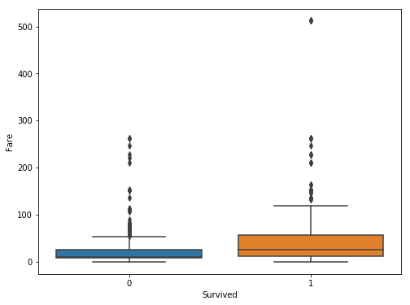
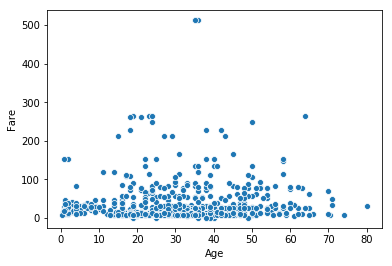

```python
import numpy as np
import pandas as pd
import matplotlib.pyplot as plt
import seaborn as sns
%matplotlib inline
```


```python
train_df = pd.read_csv('train.csv')
test_df = pd.read_csv('test.csv')
```


```python
print("Shape of training data:", train_df.shape)
print("Shape of testing data:", test_df.shape)
```

    Shape of training data: (891, 12)
    Shape of testing data: (418, 11)
    


```python
train_df.head()
```


<div>
<style scoped>
    .dataframe tbody tr th:only-of-type {
        vertical-align: middle;
    }

    .dataframe tbody tr th {
        vertical-align: top;
    }

    .dataframe thead th {
        text-align: right;
    }
</style>
<table border="1" class="dataframe">
  <thead>
    <tr style="text-align: right;">
      <th></th>
      <th>PassengerId</th>
      <th>Survived</th>
      <th>Pclass</th>
      <th>Name</th>
      <th>Sex</th>
      <th>Age</th>
      <th>SibSp</th>
      <th>Parch</th>
      <th>Ticket</th>
      <th>Fare</th>
      <th>Cabin</th>
      <th>Embarked</th>
    </tr>
  </thead>
  <tbody>
    <tr>
      <th>0</th>
      <td>1</td>
      <td>0</td>
      <td>3</td>
      <td>Braund, Mr. Owen Harris</td>
      <td>male</td>
      <td>22.0</td>
      <td>1</td>
      <td>0</td>
      <td>A/5 21171</td>
      <td>7.2500</td>
      <td>NaN</td>
      <td>S</td>
    </tr>
    <tr>
      <th>1</th>
      <td>2</td>
      <td>1</td>
      <td>1</td>
      <td>Cumings, Mrs. John Bradley (Florence Briggs Th...</td>
      <td>female</td>
      <td>38.0</td>
      <td>1</td>
      <td>0</td>
      <td>PC 17599</td>
      <td>71.2833</td>
      <td>C85</td>
      <td>C</td>
    </tr>
    <tr>
      <th>2</th>
      <td>3</td>
      <td>1</td>
      <td>3</td>
      <td>Heikkinen, Miss. Laina</td>
      <td>female</td>
      <td>26.0</td>
      <td>0</td>
      <td>0</td>
      <td>STON/O2. 3101282</td>
      <td>7.9250</td>
      <td>NaN</td>
      <td>S</td>
    </tr>
    <tr>
      <th>3</th>
      <td>4</td>
      <td>1</td>
      <td>1</td>
      <td>Futrelle, Mrs. Jacques Heath (Lily May Peel)</td>
      <td>female</td>
      <td>35.0</td>
      <td>1</td>
      <td>0</td>
      <td>113803</td>
      <td>53.1000</td>
      <td>C123</td>
      <td>S</td>
    </tr>
    <tr>
      <th>4</th>
      <td>5</td>
      <td>0</td>
      <td>3</td>
      <td>Allen, Mr. William Henry</td>
      <td>male</td>
      <td>35.0</td>
      <td>0</td>
      <td>0</td>
      <td>373450</td>
      <td>8.0500</td>
      <td>NaN</td>
      <td>S</td>
    </tr>
  </tbody>
</table>
</div>


```python
train_df.isnull().sum()
```


    PassengerId      0
    Survived         0
    Pclass           0
    Name             0
    Sex              0
    Age            177
    SibSp            0
    Parch            0
    Ticket           0
    Fare             0
    Cabin          687
    Embarked         2
    dtype: int64


For Age, Cabin and Emabrked there are missing values in training set


```python
test_df.isnull().sum()
```


    PassengerId      0
    Pclass           0
    Name             0
    Sex              0
    Age             86
    SibSp            0
    Parch            0
    Ticket           0
    Fare             1
    Cabin          327
    Embarked         0
    dtype: int64


In testing set some of the values for Age and Cabin are missing


```python
train_df[['Pclass','Survived']].groupby(by='Pclass', as_index=False).mean().sort_values(by='Survived', ascending=False)
```


<div>
<style scoped>
    .dataframe tbody tr th:only-of-type {
        vertical-align: middle;
    }

    .dataframe tbody tr th {
        vertical-align: top;
    }

    .dataframe thead th {
        text-align: right;
    }
</style>
<table border="1" class="dataframe">
  <thead>
    <tr style="text-align: right;">
      <th></th>
      <th>Pclass</th>
      <th>Survived</th>
    </tr>
  </thead>
  <tbody>
    <tr>
      <th>0</th>
      <td>1</td>
      <td>0.629630</td>
    </tr>
    <tr>
      <th>1</th>
      <td>2</td>
      <td>0.472826</td>
    </tr>
    <tr>
      <th>2</th>
      <td>3</td>
      <td>0.242363</td>
    </tr>
  </tbody>
</table>
</div>


Clearly Pclass has impact on survival rate. 


```python
train_df[['Sex','Survived']].groupby(by='Sex', as_index=False).mean().sort_values(by='Survived', ascending=False)
```


<div>
<style scoped>
    .dataframe tbody tr th:only-of-type {
        vertical-align: middle;
    }

    .dataframe tbody tr th {
        vertical-align: top;
    }

    .dataframe thead th {
        text-align: right;
    }
</style>
<table border="1" class="dataframe">
  <thead>
    <tr style="text-align: right;">
      <th></th>
      <th>Sex</th>
      <th>Survived</th>
    </tr>
  </thead>
  <tbody>
    <tr>
      <th>0</th>
      <td>female</td>
      <td>0.742038</td>
    </tr>
    <tr>
      <th>1</th>
      <td>male</td>
      <td>0.188908</td>
    </tr>
  </tbody>
</table>
</div>


Female passenger has much more survival rate than male


```python
train_df[['Embarked','Survived']].groupby(by='Embarked', as_index=False).mean().sort_values(by='Survived', ascending=False)
```


<div>
<style scoped>
    .dataframe tbody tr th:only-of-type {
        vertical-align: middle;
    }

    .dataframe tbody tr th {
        vertical-align: top;
    }

    .dataframe thead th {
        text-align: right;
    }
</style>
<table border="1" class="dataframe">
  <thead>
    <tr style="text-align: right;">
      <th></th>
      <th>Embarked</th>
      <th>Survived</th>
    </tr>
  </thead>
  <tbody>
    <tr>
      <th>0</th>
      <td>C</td>
      <td>0.553571</td>
    </tr>
    <tr>
      <th>1</th>
      <td>Q</td>
      <td>0.389610</td>
    </tr>
    <tr>
      <th>2</th>
      <td>S</td>
      <td>0.336957</td>
    </tr>
  </tbody>
</table>
</div>


```python
train_df[['SibSp','Survived']].groupby(by='SibSp', as_index=False).mean().sort_values(by='Survived', ascending=False)
```


<div>
<style scoped>
    .dataframe tbody tr th:only-of-type {
        vertical-align: middle;
    }

    .dataframe tbody tr th {
        vertical-align: top;
    }

    .dataframe thead th {
        text-align: right;
    }
</style>
<table border="1" class="dataframe">
  <thead>
    <tr style="text-align: right;">
      <th></th>
      <th>SibSp</th>
      <th>Survived</th>
    </tr>
  </thead>
  <tbody>
    <tr>
      <th>1</th>
      <td>1</td>
      <td>0.535885</td>
    </tr>
    <tr>
      <th>2</th>
      <td>2</td>
      <td>0.464286</td>
    </tr>
    <tr>
      <th>0</th>
      <td>0</td>
      <td>0.345395</td>
    </tr>
    <tr>
      <th>3</th>
      <td>3</td>
      <td>0.250000</td>
    </tr>
    <tr>
      <th>4</th>
      <td>4</td>
      <td>0.166667</td>
    </tr>
    <tr>
      <th>5</th>
      <td>5</td>
      <td>0.000000</td>
    </tr>
    <tr>
      <th>6</th>
      <td>8</td>
      <td>0.000000</td>
    </tr>
  </tbody>
</table>
</div>


```python
train_df[['Parch','Survived']].groupby(by='Parch', as_index=False).mean().sort_values(by='Survived', ascending=False)
```


<div>
<style scoped>
    .dataframe tbody tr th:only-of-type {
        vertical-align: middle;
    }

    .dataframe tbody tr th {
        vertical-align: top;
    }

    .dataframe thead th {
        text-align: right;
    }
</style>
<table border="1" class="dataframe">
  <thead>
    <tr style="text-align: right;">
      <th></th>
      <th>Parch</th>
      <th>Survived</th>
    </tr>
  </thead>
  <tbody>
    <tr>
      <th>3</th>
      <td>3</td>
      <td>0.600000</td>
    </tr>
    <tr>
      <th>1</th>
      <td>1</td>
      <td>0.550847</td>
    </tr>
    <tr>
      <th>2</th>
      <td>2</td>
      <td>0.500000</td>
    </tr>
    <tr>
      <th>0</th>
      <td>0</td>
      <td>0.343658</td>
    </tr>
    <tr>
      <th>5</th>
      <td>5</td>
      <td>0.200000</td>
    </tr>
    <tr>
      <th>4</th>
      <td>4</td>
      <td>0.000000</td>
    </tr>
    <tr>
      <th>6</th>
      <td>6</td>
      <td>0.000000</td>
    </tr>
  </tbody>
</table>
</div>


Below age 3 -> Infants
Age 3 - 16 -> Kids
Age 16 - 60 -> Adults
Age > 60 Old


```python
def get_age_group(age):
    if(age <= 3):
        return 'Infant'
    elif(age > 3 and age <=14):
        return 'Kid'
    elif(age >16 and age < 60):
        return 'Adult'
    else:
        return 'Old'
```


```python
train_df['Age_Group'] = train_df['Age'].apply(get_age_group)
```


```python
test_df['Age_Group'] = test_df['Age'].apply(get_age_group)
```


```python
train_df[['Age_Group','Survived']].groupby(by='Age_Group').sum()/train_df[['Age_Group','Survived']].groupby(by='Age_Group').count()
```


<div>
<style scoped>
    .dataframe tbody tr th:only-of-type {
        vertical-align: middle;
    }

    .dataframe tbody tr th {
        vertical-align: top;
    }

    .dataframe thead th {
        text-align: right;
    }
</style>
<table border="1" class="dataframe">
  <thead>
    <tr style="text-align: right;">
      <th></th>
      <th>Survived</th>
    </tr>
    <tr>
      <th>Age_Group</th>
      <th></th>
    </tr>
  </thead>
  <tbody>
    <tr>
      <th>Adult</th>
      <td>0.387755</td>
    </tr>
    <tr>
      <th>Infant</th>
      <td>0.666667</td>
    </tr>
    <tr>
      <th>Kid</th>
      <td>0.531915</td>
    </tr>
    <tr>
      <th>Old</th>
      <td>0.305310</td>
    </tr>
  </tbody>
</table>
</div>


Kids and infants have high survival rate 53% and 66% respectively


```python
plt.figure(figsize=(8,6))
sns.boxplot(data=train_df, x='Survived', y='Fare')
```


    <matplotlib.axes._subplots.AxesSubplot at 0x25841978a90>





High Fare high chance of survival

# Handling missing values

Cabin column has lots of missing values. We will drop this column. Also from name column we can get information about sex and age which we alrady have. So we will drop this column also

We will clean missing values together for training and testing set


```python
y = train_df['Survived']
```


    ---------------------------------------------------------------------------

    KeyError                                  Traceback (most recent call last)

    C:\Program Files\Anaconda3\lib\site-packages\pandas\core\indexes\base.py in get_loc(self, key, method, tolerance)
       3077             try:
    -> 3078                 return self._engine.get_loc(key)
       3079             except KeyError:
    

    pandas\_libs\index.pyx in pandas._libs.index.IndexEngine.get_loc()
    

    pandas\_libs\index.pyx in pandas._libs.index.IndexEngine.get_loc()
    

    pandas\_libs\hashtable_class_helper.pxi in pandas._libs.hashtable.PyObjectHashTable.get_item()
    

    pandas\_libs\hashtable_class_helper.pxi in pandas._libs.hashtable.PyObjectHashTable.get_item()
    

    KeyError: 'Survived'

    
    During handling of the above exception, another exception occurred:
    

    KeyError                                  Traceback (most recent call last)

    <ipython-input-41-7b66c11c67a2> in <module>()
    ----> 1 y = train_df['Survived']
    

    C:\Program Files\Anaconda3\lib\site-packages\pandas\core\frame.py in __getitem__(self, key)
       2686             return self._getitem_multilevel(key)
       2687         else:
    -> 2688             return self._getitem_column(key)
       2689 
       2690     def _getitem_column(self, key):
    

    C:\Program Files\Anaconda3\lib\site-packages\pandas\core\frame.py in _getitem_column(self, key)
       2693         # get column
       2694         if self.columns.is_unique:
    -> 2695             return self._get_item_cache(key)
       2696 
       2697         # duplicate columns & possible reduce dimensionality
    

    C:\Program Files\Anaconda3\lib\site-packages\pandas\core\generic.py in _get_item_cache(self, item)
       2487         res = cache.get(item)
       2488         if res is None:
    -> 2489             values = self._data.get(item)
       2490             res = self._box_item_values(item, values)
       2491             cache[item] = res
    

    C:\Program Files\Anaconda3\lib\site-packages\pandas\core\internals.py in get(self, item, fastpath)
       4113 
       4114             if not isna(item):
    -> 4115                 loc = self.items.get_loc(item)
       4116             else:
       4117                 indexer = np.arange(len(self.items))[isna(self.items)]
    

    C:\Program Files\Anaconda3\lib\site-packages\pandas\core\indexes\base.py in get_loc(self, key, method, tolerance)
       3078                 return self._engine.get_loc(key)
       3079             except KeyError:
    -> 3080                 return self._engine.get_loc(self._maybe_cast_indexer(key))
       3081 
       3082         indexer = self.get_indexer([key], method=method, tolerance=tolerance)
    

    pandas\_libs\index.pyx in pandas._libs.index.IndexEngine.get_loc()
    

    pandas\_libs\index.pyx in pandas._libs.index.IndexEngine.get_loc()
    

    pandas\_libs\hashtable_class_helper.pxi in pandas._libs.hashtable.PyObjectHashTable.get_item()
    

    pandas\_libs\hashtable_class_helper.pxi in pandas._libs.hashtable.PyObjectHashTable.get_item()
    

    KeyError: 'Survived'


```python
train_df.drop('Survived', axis=1, inplace=True)
```


    ---------------------------------------------------------------------------

    KeyError                                  Traceback (most recent call last)

    <ipython-input-42-ae78961b9301> in <module>()
    ----> 1 train_df.drop('Survived', axis=1, inplace=True)
    

    C:\Program Files\Anaconda3\lib\site-packages\pandas\core\frame.py in drop(self, labels, axis, index, columns, level, inplace, errors)
       3695                                            index=index, columns=columns,
       3696                                            level=level, inplace=inplace,
    -> 3697                                            errors=errors)
       3698 
       3699     @rewrite_axis_style_signature('mapper', [('copy', True),
    

    C:\Program Files\Anaconda3\lib\site-packages\pandas\core\generic.py in drop(self, labels, axis, index, columns, level, inplace, errors)
       3109         for axis, labels in axes.items():
       3110             if labels is not None:
    -> 3111                 obj = obj._drop_axis(labels, axis, level=level, errors=errors)
       3112 
       3113         if inplace:
    

    C:\Program Files\Anaconda3\lib\site-packages\pandas\core\generic.py in _drop_axis(self, labels, axis, level, errors)
       3141                 new_axis = axis.drop(labels, level=level, errors=errors)
       3142             else:
    -> 3143                 new_axis = axis.drop(labels, errors=errors)
       3144             result = self.reindex(**{axis_name: new_axis})
       3145 
    

    C:\Program Files\Anaconda3\lib\site-packages\pandas\core\indexes\base.py in drop(self, labels, errors)
       4402             if errors != 'ignore':
       4403                 raise KeyError(
    -> 4404                     '{} not found in axis'.format(labels[mask]))
       4405             indexer = indexer[~mask]
       4406         return self.delete(indexer)
    

    KeyError: "['Survived'] not found in axis"


```python
df =pd.concat([train_df, test_df], axis=0)
```


```python
df.shape
```


    (1309, 12)


```python
df.head()
```


<div>
<style scoped>
    .dataframe tbody tr th:only-of-type {
        vertical-align: middle;
    }

    .dataframe tbody tr th {
        vertical-align: top;
    }

    .dataframe thead th {
        text-align: right;
    }
</style>
<table border="1" class="dataframe">
  <thead>
    <tr style="text-align: right;">
      <th></th>
      <th>PassengerId</th>
      <th>Pclass</th>
      <th>Name</th>
      <th>Sex</th>
      <th>Age</th>
      <th>SibSp</th>
      <th>Parch</th>
      <th>Ticket</th>
      <th>Fare</th>
      <th>Cabin</th>
      <th>Embarked</th>
      <th>Age_Group</th>
    </tr>
  </thead>
  <tbody>
    <tr>
      <th>0</th>
      <td>1</td>
      <td>3</td>
      <td>Braund, Mr. Owen Harris</td>
      <td>male</td>
      <td>22.0</td>
      <td>1</td>
      <td>0</td>
      <td>A/5 21171</td>
      <td>7.2500</td>
      <td>NaN</td>
      <td>S</td>
      <td>Adult</td>
    </tr>
    <tr>
      <th>1</th>
      <td>2</td>
      <td>1</td>
      <td>Cumings, Mrs. John Bradley (Florence Briggs Th...</td>
      <td>female</td>
      <td>38.0</td>
      <td>1</td>
      <td>0</td>
      <td>PC 17599</td>
      <td>71.2833</td>
      <td>C85</td>
      <td>C</td>
      <td>Adult</td>
    </tr>
    <tr>
      <th>2</th>
      <td>3</td>
      <td>3</td>
      <td>Heikkinen, Miss. Laina</td>
      <td>female</td>
      <td>26.0</td>
      <td>0</td>
      <td>0</td>
      <td>STON/O2. 3101282</td>
      <td>7.9250</td>
      <td>NaN</td>
      <td>S</td>
      <td>Adult</td>
    </tr>
    <tr>
      <th>3</th>
      <td>4</td>
      <td>1</td>
      <td>Futrelle, Mrs. Jacques Heath (Lily May Peel)</td>
      <td>female</td>
      <td>35.0</td>
      <td>1</td>
      <td>0</td>
      <td>113803</td>
      <td>53.1000</td>
      <td>C123</td>
      <td>S</td>
      <td>Adult</td>
    </tr>
    <tr>
      <th>4</th>
      <td>5</td>
      <td>3</td>
      <td>Allen, Mr. William Henry</td>
      <td>male</td>
      <td>35.0</td>
      <td>0</td>
      <td>0</td>
      <td>373450</td>
      <td>8.0500</td>
      <td>NaN</td>
      <td>S</td>
      <td>Adult</td>
    </tr>
  </tbody>
</table>
</div>


```python
df.drop(['Name','Cabin'], axis=1, inplace=True)
```


```python
df.isnull().sum()
```


    PassengerId      0
    Pclass           0
    Sex              0
    Age            263
    SibSp            0
    Parch            0
    Ticket           0
    Fare             1
    Embarked         2
    Age_Group        0
    dtype: int64


```python
df['Fare'].mean()
```


    33.29547928134557


```python
df['Fare'] = df['Fare'].fillna(33.29)
```


```python
df['Embarked'].mode()
```


    0    S
    dtype: object


```python
df['Embarked'] = df['Embarked'].fillna('S')
```


```python
df.isnull().sum()
```


    PassengerId      0
    Pclass           0
    Sex              0
    Age            263
    SibSp            0
    Parch            0
    Ticket           0
    Fare             0
    Embarked         0
    Age_Group        0
    dtype: int64


```python
df.drop(['Ticket','Age_Group'], axis=1, inplace=True)
```


```python
df.isnull().sum()
```


    PassengerId      0
    Pclass           0
    Sex              0
    Age            263
    SibSp            0
    Parch            0
    Fare             0
    Embarked         0
    dtype: int64


Let's find value to replace missing Age value


```python
df[['Pclass', 'Age']].groupby(['Pclass']).mean()
```


<div>
<style scoped>
    .dataframe tbody tr th:only-of-type {
        vertical-align: middle;
    }

    .dataframe tbody tr th {
        vertical-align: top;
    }

    .dataframe thead th {
        text-align: right;
    }
</style>
<table border="1" class="dataframe">
  <thead>
    <tr style="text-align: right;">
      <th></th>
      <th>Age</th>
    </tr>
    <tr>
      <th>Pclass</th>
      <th></th>
    </tr>
  </thead>
  <tbody>
    <tr>
      <th>1</th>
      <td>39.159930</td>
    </tr>
    <tr>
      <th>2</th>
      <td>29.506705</td>
    </tr>
    <tr>
      <th>3</th>
      <td>24.816367</td>
    </tr>
  </tbody>
</table>
</div>


```python
sns.scatterplot(data=train_df, x='Age', y='Fare')
```


    <matplotlib.axes._subplots.AxesSubplot at 0x25841adc6d8>





There seems no relation between age and fare


```python
def impute_age(cols):
    age = cols[0]
    pclass=cols[1]
    if(pd.isnull(age)):
        if(pclass == 1):
            return 39
        elif(pclass == 2):
            return 29
        else:
            return 25
    else:
        return age
```


```python
df['Age'] = df[['Age','Pclass']].apply(impute_age,axis=1)
```


```python
df.isnull().sum()
```


    PassengerId    0
    Pclass         0
    Sex            0
    Age            0
    SibSp          0
    Parch          0
    Fare           0
    Embarked       0
    dtype: int64


### Coverting Categorical values


```python
df.head()

```


<div>
<style scoped>
    .dataframe tbody tr th:only-of-type {
        vertical-align: middle;
    }

    .dataframe tbody tr th {
        vertical-align: top;
    }

    .dataframe thead th {
        text-align: right;
    }
</style>
<table border="1" class="dataframe">
  <thead>
    <tr style="text-align: right;">
      <th></th>
      <th>PassengerId</th>
      <th>Pclass</th>
      <th>Sex</th>
      <th>Age</th>
      <th>SibSp</th>
      <th>Parch</th>
      <th>Fare</th>
      <th>Embarked</th>
    </tr>
  </thead>
  <tbody>
    <tr>
      <th>0</th>
      <td>1</td>
      <td>3</td>
      <td>male</td>
      <td>22.0</td>
      <td>1</td>
      <td>0</td>
      <td>7.2500</td>
      <td>S</td>
    </tr>
    <tr>
      <th>1</th>
      <td>2</td>
      <td>1</td>
      <td>female</td>
      <td>38.0</td>
      <td>1</td>
      <td>0</td>
      <td>71.2833</td>
      <td>C</td>
    </tr>
    <tr>
      <th>2</th>
      <td>3</td>
      <td>3</td>
      <td>female</td>
      <td>26.0</td>
      <td>0</td>
      <td>0</td>
      <td>7.9250</td>
      <td>S</td>
    </tr>
    <tr>
      <th>3</th>
      <td>4</td>
      <td>1</td>
      <td>female</td>
      <td>35.0</td>
      <td>1</td>
      <td>0</td>
      <td>53.1000</td>
      <td>S</td>
    </tr>
    <tr>
      <th>4</th>
      <td>5</td>
      <td>3</td>
      <td>male</td>
      <td>35.0</td>
      <td>0</td>
      <td>0</td>
      <td>8.0500</td>
      <td>S</td>
    </tr>
  </tbody>
</table>
</div>


```python
df['Sex']=df['Sex'].replace({'male':1,'female':0})
```


```python
df.head()
```


<div>
<style scoped>
    .dataframe tbody tr th:only-of-type {
        vertical-align: middle;
    }

    .dataframe tbody tr th {
        vertical-align: top;
    }

    .dataframe thead th {
        text-align: right;
    }
</style>
<table border="1" class="dataframe">
  <thead>
    <tr style="text-align: right;">
      <th></th>
      <th>PassengerId</th>
      <th>Pclass</th>
      <th>Sex</th>
      <th>Age</th>
      <th>SibSp</th>
      <th>Parch</th>
      <th>Fare</th>
      <th>Embarked</th>
    </tr>
  </thead>
  <tbody>
    <tr>
      <th>0</th>
      <td>1</td>
      <td>3</td>
      <td>1</td>
      <td>22.0</td>
      <td>1</td>
      <td>0</td>
      <td>7.2500</td>
      <td>S</td>
    </tr>
    <tr>
      <th>1</th>
      <td>2</td>
      <td>1</td>
      <td>0</td>
      <td>38.0</td>
      <td>1</td>
      <td>0</td>
      <td>71.2833</td>
      <td>C</td>
    </tr>
    <tr>
      <th>2</th>
      <td>3</td>
      <td>3</td>
      <td>0</td>
      <td>26.0</td>
      <td>0</td>
      <td>0</td>
      <td>7.9250</td>
      <td>S</td>
    </tr>
    <tr>
      <th>3</th>
      <td>4</td>
      <td>1</td>
      <td>0</td>
      <td>35.0</td>
      <td>1</td>
      <td>0</td>
      <td>53.1000</td>
      <td>S</td>
    </tr>
    <tr>
      <th>4</th>
      <td>5</td>
      <td>3</td>
      <td>1</td>
      <td>35.0</td>
      <td>0</td>
      <td>0</td>
      <td>8.0500</td>
      <td>S</td>
    </tr>
  </tbody>
</table>
</div>


```python
df = pd.get_dummies(df, columns=['Embarked'])
```


```python
df.head()
```


<div>
<style scoped>
    .dataframe tbody tr th:only-of-type {
        vertical-align: middle;
    }

    .dataframe tbody tr th {
        vertical-align: top;
    }

    .dataframe thead th {
        text-align: right;
    }
</style>
<table border="1" class="dataframe">
  <thead>
    <tr style="text-align: right;">
      <th></th>
      <th>PassengerId</th>
      <th>Pclass</th>
      <th>Sex</th>
      <th>Age</th>
      <th>SibSp</th>
      <th>Parch</th>
      <th>Fare</th>
      <th>Embarked_C</th>
      <th>Embarked_Q</th>
      <th>Embarked_S</th>
    </tr>
  </thead>
  <tbody>
    <tr>
      <th>0</th>
      <td>1</td>
      <td>3</td>
      <td>1</td>
      <td>22.0</td>
      <td>1</td>
      <td>0</td>
      <td>7.2500</td>
      <td>0</td>
      <td>0</td>
      <td>1</td>
    </tr>
    <tr>
      <th>1</th>
      <td>2</td>
      <td>1</td>
      <td>0</td>
      <td>38.0</td>
      <td>1</td>
      <td>0</td>
      <td>71.2833</td>
      <td>1</td>
      <td>0</td>
      <td>0</td>
    </tr>
    <tr>
      <th>2</th>
      <td>3</td>
      <td>3</td>
      <td>0</td>
      <td>26.0</td>
      <td>0</td>
      <td>0</td>
      <td>7.9250</td>
      <td>0</td>
      <td>0</td>
      <td>1</td>
    </tr>
    <tr>
      <th>3</th>
      <td>4</td>
      <td>1</td>
      <td>0</td>
      <td>35.0</td>
      <td>1</td>
      <td>0</td>
      <td>53.1000</td>
      <td>0</td>
      <td>0</td>
      <td>1</td>
    </tr>
    <tr>
      <th>4</th>
      <td>5</td>
      <td>3</td>
      <td>1</td>
      <td>35.0</td>
      <td>0</td>
      <td>0</td>
      <td>8.0500</td>
      <td>0</td>
      <td>0</td>
      <td>1</td>
    </tr>
  </tbody>
</table>
</div>


```python
train = df.iloc[:891,:]
test =df.iloc[891:,:]
```


```python
train.shape
```


    (891, 10)


```python
test.shape
```


    (418, 10)


```python
y.shape
```


    (891,)


```python
test_passenge_ids = test['PassengerId']
```


```python
train = df.iloc[:891,1:]
test =df.iloc[891:,1:]
```

# Training and Tesitng model


```python
from sklearn.model_selection import train_test_split
```


```python
X_train, X_test, y_train,y_test = train_test_split(train, y, test_size=0.2, random_state=12)
```


```python
from sklearn.linear_model import LogisticRegression
from sklearn.svm import SVC, LinearSVC
from sklearn.ensemble import RandomForestClassifier
from sklearn.neighbors import KNeighborsClassifier
from sklearn.naive_bayes import GaussianNB
from sklearn.tree import DecisionTreeClassifier
from xgboost import XGBClassifier
```

    C:\Program Files\Anaconda3\lib\site-packages\xgboost\__init__.py:29: FutureWarning: Python 3.5 support is deprecated; XGBoost will require Python 3.6+ in the near future. Consider upgrading to Python 3.6+.
      FutureWarning)
    


```python
from sklearn.metrics import accuracy_score
```


```python
classifiers = [LogisticRegression(),SVC(), LinearSVC(),RandomForestClassifier(),KNeighborsClassifier(),GaussianNB(),DecisionTreeClassifier(),XGBClassifier() ]
names =['Logistic Regression','SVC','Linear SVC', 'Random Forrest','KNN','GaussianNB','Decision Tree', 'XGB']
```


```python
for i in range(len(names)):
    print(names[i])
    classifiers[i].fit(X_train, y_train)
    y_train_pred = classifiers[i].predict(X_train)
    y_test_pred =classifiers[i].predict(X_test)
    print("Training set accuracy:", accuracy_score(y_train, y_train_pred))
    print("Testing set accuracy:", accuracy_score(y_test, y_test_pred))
    print('-'*100)
```

    Logistic Regression
    Training set accuracy: 0.8061797752808989
    Testing set accuracy: 0.7821229050279329
    ----------------------------------------------------------------------------------------------------
    SVC
    Training set accuracy: 0.8890449438202247
    Testing set accuracy: 0.664804469273743
    ----------------------------------------------------------------------------------------------------
    Linear SVC
    Training set accuracy: 0.75
    Testing set accuracy: 0.7262569832402235
    ----------------------------------------------------------------------------------------------------
    Random Forrest
    Training set accuracy: 0.9592696629213483
    Testing set accuracy: 0.7486033519553073
    ----------------------------------------------------------------------------------------------------
    KNN
    Training set accuracy: 0.7879213483146067
    Testing set accuracy: 0.659217877094972
    ----------------------------------------------------------------------------------------------------
    GaussianNB
    Training set accuracy: 0.8075842696629213
    Testing set accuracy: 0.7374301675977654
    ----------------------------------------------------------------------------------------------------
    Decision Tree
    Training set accuracy: 0.9831460674157303
    Testing set accuracy: 0.770949720670391
    ----------------------------------------------------------------------------------------------------
    XGB
    

    C:\Program Files\Anaconda3\lib\site-packages\sklearn\linear_model\logistic.py:432: FutureWarning: Default solver will be changed to 'lbfgs' in 0.22. Specify a solver to silence this warning.
      FutureWarning)
    C:\Program Files\Anaconda3\lib\site-packages\sklearn\svm\base.py:196: FutureWarning: The default value of gamma will change from 'auto' to 'scale' in version 0.22 to account better for unscaled features. Set gamma explicitly to 'auto' or 'scale' to avoid this warning.
      "avoid this warning.", FutureWarning)
    C:\Program Files\Anaconda3\lib\site-packages\sklearn\svm\base.py:922: ConvergenceWarning: Liblinear failed to converge, increase the number of iterations.
      "the number of iterations.", ConvergenceWarning)
    C:\Program Files\Anaconda3\lib\site-packages\sklearn\ensemble\forest.py:248: FutureWarning: The default value of n_estimators will change from 10 in version 0.20 to 100 in 0.22.
      "10 in version 0.20 to 100 in 0.22.", FutureWarning)
    

    Training set accuracy: 0.9719101123595506
    Testing set accuracy: 0.7653631284916201
    ----------------------------------------------------------------------------------------------------
    

# Final Prediction


```python
rf =RandomForestClassifier()
rf.fit(train, y)
rf_pred = rf.predict(test)
```

    C:\Program Files\Anaconda3\lib\site-packages\sklearn\ensemble\forest.py:248: FutureWarning: The default value of n_estimators will change from 10 in version 0.20 to 100 in 0.22.
      "10 in version 0.20 to 100 in 0.22.", FutureWarning)
    


```python
dtc =DecisionTreeClassifier()
dtc.fit(train, y)
dtc_pred = dtc.predict(test)
```


```python
xgb = XGBClassifier()
xgb.fit(train, y)
xgb_pred = xgb.predict(test)
```


```python
rf_df = pd.DataFrame({'PassengerId':test_passenge_ids, 'Survived':rf_pred})
dtc_df = pd.DataFrame({'PassengerId':test_passenge_ids, 'Survived':dtc_pred})
xgb_df = pd.DataFrame({'PassengerId':test_passenge_ids, 'Survived':xgb_pred})
```


```python
rf_df.to_csv('Random_forrest.csv', index=False)
dtc_df.to_csv('Decision_Tree.csv', index=False)
xgb_df.to_csv('XGBoost.csv',index=False)
```


```python

```
