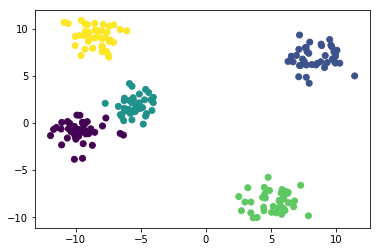
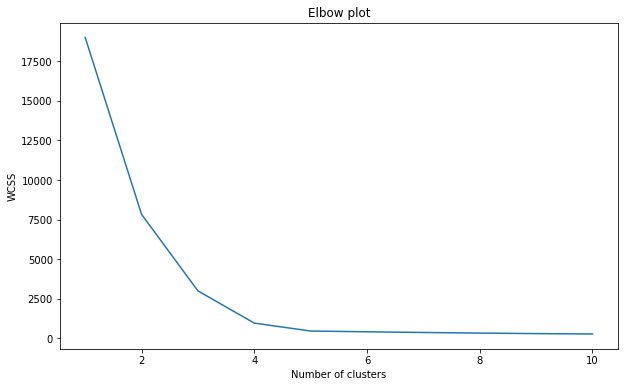
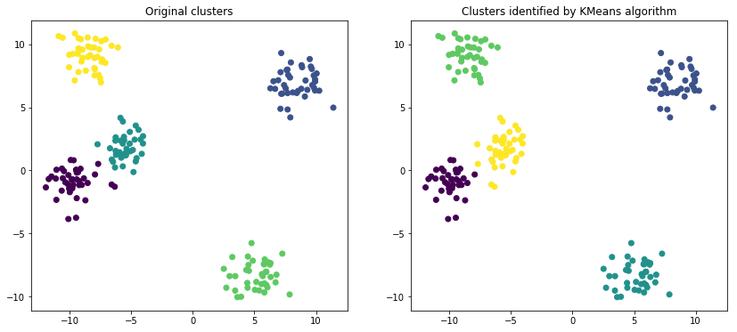
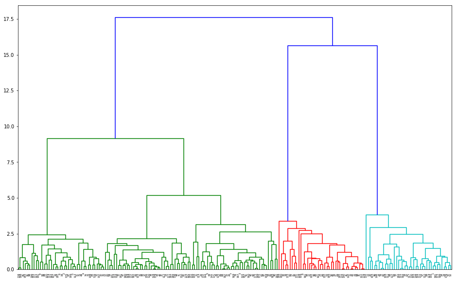
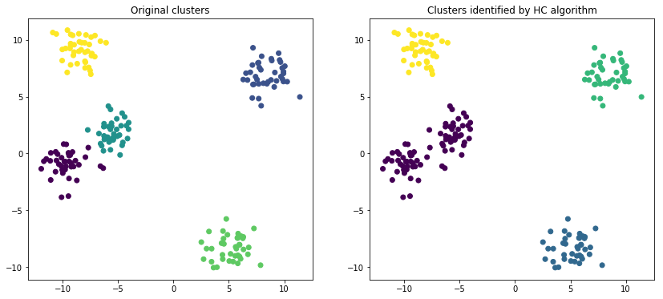
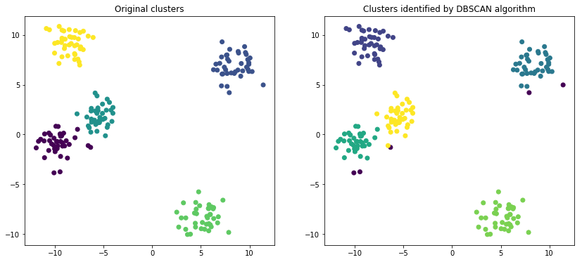

## Import required Libraries


```python
import numpy as np
import pandas as pd
import matplotlib.pyplot as plt
from sklearn.datasets import make_blobs
%matplotlib inline
```

# Create dummy clusters


```python
data = make_blobs(n_samples=200,n_features=2,cluster_std=1.1, centers=5)
```


```python
X = data[0]
labels = data[1]
```


```python
X[0:5]
```


    array([[-8.27858467,  9.76533488],
           [ 9.70311384,  6.77469697],
           [-7.7491532 ,  9.01568347],
           [-8.53706303, -1.00051199],
           [-9.27736542, 10.49311856]])


```python
plt.scatter(X[:,0], X[:,1], c=labels)
```


    <matplotlib.collections.PathCollection at 0x16896b7d748>





```python

```

# KMeans clustering


```python

```


```python
from sklearn.cluster import KMeans
```


```python
wcss = []

for i in range(1,11):
    kmeans = KMeans(n_clusters=i)
    kmeans.fit(X)
    wcss.append(kmeans.inertia_)

plt.figure(figsize=(10,6))    
plt.plot(range(1,11), wcss)
plt.xlabel('Number of clusters')
plt.ylabel('WCSS')
plt.title('Elbow plot')
```


    Text(0.5, 1.0, 'Elbow plot')





### Conclusion - We will chose 5 as number of clusters


```python
kmeans = KMeans(n_clusters=5)
new_labels = kmeans.fit_predict(X)
```


```python

fig,(ax1,ax2) = plt.subplots(nrows=1,ncols=2, figsize=(14,6))
ax2.scatter(X[:,0], X[:,1], c=new_labels)
ax2.set_title('Clusters identified by KMeans algorithm')
ax1.scatter(X[:,0], X[:,1], c=labels)
ax1.set_title('Original clusters')
```


    Text(0.5, 1.0, 'Original clusters')





# Hierarchical (Agglomerative clustering)

We will apply agglomerative clusteing to same data


```python

```


```python
import scipy.cluster.hierarchy  as sch
```


```python
z = sch.linkage(X,'average')
plt.figure(figsize=(16,10))
dn =sch.dendrogram(z)
```





### Conclusion - We can take cut from 7.5 so that it will intercept 4 lines i.e. 4 clusters


```python
from  sklearn.cluster import AgglomerativeClustering
```


```python
ac = AgglomerativeClustering(n_clusters=4)
```


```python
new_labels = ac.fit_predict(X)
```


```python
fig,(ax1,ax2) = plt.subplots(nrows=1,ncols=2, figsize=(14,6))
ax2.scatter(X[:,0], X[:,1], c=new_labels)
ax2.set_title('Clusters identified by HC algorithm')
ax1.scatter(X[:,0], X[:,1], c=labels)
ax1.set_title('Original clusters')
```


    Text(0.5, 1.0, 'Original clusters')





# Clustering using DBSCAN


```python
from sklearn.cluster import DBSCAN
```


```python
dbscan = DBSCAN(eps=1.5, min_samples=10)
```


```python
new_labels = dbscan.fit_predict(X)
```


```python
set(new_labels)
```


    {-1, 0, 1, 2, 3, 4}


### DBSCAN has also idnetified  5 clusters. -1 correspond to outlier


```python
fig,(ax1,ax2) = plt.subplots(nrows=1,ncols=2, figsize=(14,6))
ax2.scatter(X[:,0], X[:,1], c=new_labels)
ax2.set_title('Clusters identified by DBSCAN algorithm')
ax1.scatter(X[:,0], X[:,1], c=labels)
ax1.set_title('Original clusters')
```


    Text(0.5, 1.0, 'Original clusters')





```python

```
