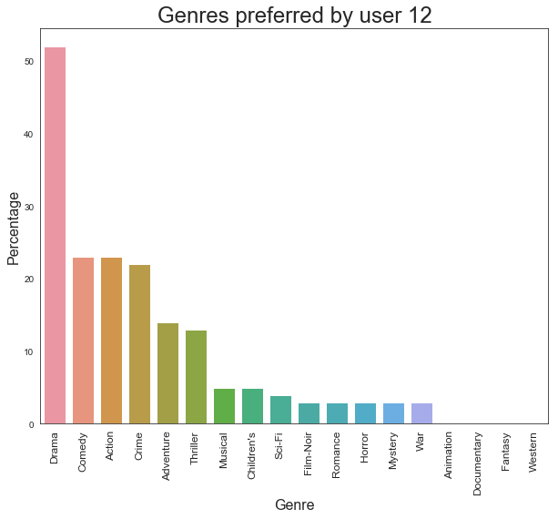

# Content based recommender system

Content based recommnder system works based on the genre of the movie and rating provided by user the for movies.

Suppose user has rated movies as following

|Movie Name  | Genres   | Rating | 
|------------- | ------------- | ------|
|Movie A  | Drama, Action, Commedy |  4 |
|Movie B  | Comedy, Adenture | 5 |

We encode movies with one hot encoding schema


|         | Drama | Action  | Comedy | Adventure |
|---------|-------|---------|--------|-----------|
| Movie A | 1     | 1       | 1      | 0         |
| Movie B | 0     | 0       | 1      | 1         |


We calculate weighted feature matrix by multiplying ratings to Weighted genre matrix

|         | Drama | Action  | Comedy | Adventure |
|---------|-------|---------|--------|-----------|
| Movie A | 4     | 4       | 4      | 0         |
| Movie B | 0     | 0       | 5      | 5         |

Create user profile by taking sum along columns

| Drama | Action  | Comedy | Adventure |
|---------|-------|---------|--------|-----------|
| 4     | 4       | 9      | 5         |


Create Normalised user profile

| Drama | Action  | Comedy | Adventure |
|-------|---------|--------|-----------|
 | 0.18  | 0.18    | 0.41   | 0.23      |
 
We have following movies to recommend to user with genre

|         | Drama | Action  | Comedy | Adventure |
|---------|-------|---------|--------|-----------|
| Movie C | 1     | 0       | 0      | 1         |
| Movie D | 0     | 1       | 1      | 0         |
| Movie E | 1     | 0       | 0      | 0         |

We will multiply user profile with this matrix and take sum along row

|         | Drama | Action  | Comedy | Adventure | Total 
|---------|-------|---------|--------|-----------| ------|
| Movie C | 0.18  | 0       | 0      | 0.23      | 0.41  |
| Movie D | 0     | 0.18    | 0.41   | 0         | 0.59 |
| Movie E | 0.18  | 0       | 0      | 0         | 0.18 |

This is our recommendation matrix. We can recommend Movie D to user

## Download data

Data can be downloaded from MovieLens database
http://files.grouplens.org/datasets/movielens/ml-1m.zip

### Import required libraries


```python
import numpy as np
import pandas as pd
import matplotlib.pyplot as plt
import seaborn as sns
sns.set_style('white')
%matplotlib inline
```

### Import Dataset


```python
movies_df = pd.read_csv('movies.csv', sep='::', names=['MovieID','Title','Genres'])
ratings_df = pd.read_csv('ratings.csv', sep='::', names=['UserID','MovieID','Rating','Timestamp'])
users_df = pd.read_csv('users.csv', sep='::',names=['UserID','Gender','Age','Occupation','Zip-code'])
```

    C:\Program Files\Anaconda3\lib\site-packages\ipykernel\__main__.py:1: ParserWarning: Falling back to the 'python' engine because the 'c' engine does not support regex separators (separators > 1 char and different from '\s+' are interpreted as regex); you can avoid this warning by specifying engine='python'.
      if __name__ == '__main__':
    C:\Program Files\Anaconda3\lib\site-packages\ipykernel\__main__.py:2: ParserWarning: Falling back to the 'python' engine because the 'c' engine does not support regex separators (separators > 1 char and different from '\s+' are interpreted as regex); you can avoid this warning by specifying engine='python'.
      from ipykernel import kernelapp as app
    C:\Program Files\Anaconda3\lib\site-packages\ipykernel\__main__.py:3: ParserWarning: Falling back to the 'python' engine because the 'c' engine does not support regex separators (separators > 1 char and different from '\s+' are interpreted as regex); you can avoid this warning by specifying engine='python'.
      app.launch_new_instance()
    

### Let's take a quick look at our data


```python
movies_df.head()
```


<div>
<style scoped>
    .dataframe tbody tr th:only-of-type {
        vertical-align: middle;
    }

    .dataframe tbody tr th {
        vertical-align: top;
    }

    .dataframe thead th {
        text-align: right;
    }
</style>
<table border="1" class="dataframe">
  <thead>
    <tr style="text-align: right;">
      <th></th>
      <th>MovieID</th>
      <th>Title</th>
      <th>Genres</th>
    </tr>
  </thead>
  <tbody>
    <tr>
      <th>0</th>
      <td>1</td>
      <td>Toy Story (1995)</td>
      <td>Animation|Children's|Comedy</td>
    </tr>
    <tr>
      <th>1</th>
      <td>2</td>
      <td>Jumanji (1995)</td>
      <td>Adventure|Children's|Fantasy</td>
    </tr>
    <tr>
      <th>2</th>
      <td>3</td>
      <td>Grumpier Old Men (1995)</td>
      <td>Comedy|Romance</td>
    </tr>
    <tr>
      <th>3</th>
      <td>4</td>
      <td>Waiting to Exhale (1995)</td>
      <td>Comedy|Drama</td>
    </tr>
    <tr>
      <th>4</th>
      <td>5</td>
      <td>Father of the Bride Part II (1995)</td>
      <td>Comedy</td>
    </tr>
  </tbody>
</table>
</div>


```python
movies_df.shape
```


    (3883, 3)


```python
ratings_df.head()
```


<div>
<style scoped>
    .dataframe tbody tr th:only-of-type {
        vertical-align: middle;
    }

    .dataframe tbody tr th {
        vertical-align: top;
    }

    .dataframe thead th {
        text-align: right;
    }
</style>
<table border="1" class="dataframe">
  <thead>
    <tr style="text-align: right;">
      <th></th>
      <th>UserID</th>
      <th>MovieID</th>
      <th>Rating</th>
      <th>Timestamp</th>
    </tr>
  </thead>
  <tbody>
    <tr>
      <th>0</th>
      <td>1</td>
      <td>1193</td>
      <td>5</td>
      <td>978300760</td>
    </tr>
    <tr>
      <th>1</th>
      <td>1</td>
      <td>661</td>
      <td>3</td>
      <td>978302109</td>
    </tr>
    <tr>
      <th>2</th>
      <td>1</td>
      <td>914</td>
      <td>3</td>
      <td>978301968</td>
    </tr>
    <tr>
      <th>3</th>
      <td>1</td>
      <td>3408</td>
      <td>4</td>
      <td>978300275</td>
    </tr>
    <tr>
      <th>4</th>
      <td>1</td>
      <td>2355</td>
      <td>5</td>
      <td>978824291</td>
    </tr>
  </tbody>
</table>
</div>


```python
ratings_df.shape
```


    (1000209, 4)


```python
users_df.head()
```


<div>
<style scoped>
    .dataframe tbody tr th:only-of-type {
        vertical-align: middle;
    }

    .dataframe tbody tr th {
        vertical-align: top;
    }

    .dataframe thead th {
        text-align: right;
    }
</style>
<table border="1" class="dataframe">
  <thead>
    <tr style="text-align: right;">
      <th></th>
      <th>UserID</th>
      <th>Gender</th>
      <th>Age</th>
      <th>Occupation</th>
      <th>Zip-code</th>
    </tr>
  </thead>
  <tbody>
    <tr>
      <th>0</th>
      <td>1</td>
      <td>F</td>
      <td>1</td>
      <td>10</td>
      <td>48067</td>
    </tr>
    <tr>
      <th>1</th>
      <td>2</td>
      <td>M</td>
      <td>56</td>
      <td>16</td>
      <td>70072</td>
    </tr>
    <tr>
      <th>2</th>
      <td>3</td>
      <td>M</td>
      <td>25</td>
      <td>15</td>
      <td>55117</td>
    </tr>
    <tr>
      <th>3</th>
      <td>4</td>
      <td>M</td>
      <td>45</td>
      <td>7</td>
      <td>02460</td>
    </tr>
    <tr>
      <th>4</th>
      <td>5</td>
      <td>M</td>
      <td>25</td>
      <td>20</td>
      <td>55455</td>
    </tr>
  </tbody>
</table>
</div>


```python
users_df.shape
```


    (6040, 5)


### Preprocessing of Movies dataframe


Extracting year from title and creating separate column


```python
movies_df['Year'] = movies_df['Title'].str.extract('(\(\d\d\d\d\))')
```


```python
movies_df['Year'] = movies_df['Year'].str.extract('(\d\d\d\d)')
```

 Now as we have extracted year and created separate column, we can remove it from title


```python
movies_df['Title'] = movies_df['Title'].str.replace('(\(\d\d\d\d\))','')
```

Remove white spaces from the beginning and end of the Title


```python
movies_df['Title'] = movies_df['Title'].apply(lambda title : title.strip())
```

### Processing Genres columns

We will split Genres on '|' and create list with python split function


```python
movies_df['Genres'] = movies_df['Genres'].apply(lambda genres : genres.split('|'))
```


```python
movies_df.head()
```


<div>
<style scoped>
    .dataframe tbody tr th:only-of-type {
        vertical-align: middle;
    }

    .dataframe tbody tr th {
        vertical-align: top;
    }

    .dataframe thead th {
        text-align: right;
    }
</style>
<table border="1" class="dataframe">
  <thead>
    <tr style="text-align: right;">
      <th></th>
      <th>MovieID</th>
      <th>Title</th>
      <th>Genres</th>
      <th>Year</th>
    </tr>
  </thead>
  <tbody>
    <tr>
      <th>0</th>
      <td>1</td>
      <td>Toy Story</td>
      <td>[Animation, Children's, Comedy]</td>
      <td>1995</td>
    </tr>
    <tr>
      <th>1</th>
      <td>2</td>
      <td>Jumanji</td>
      <td>[Adventure, Children's, Fantasy]</td>
      <td>1995</td>
    </tr>
    <tr>
      <th>2</th>
      <td>3</td>
      <td>Grumpier Old Men</td>
      <td>[Comedy, Romance]</td>
      <td>1995</td>
    </tr>
    <tr>
      <th>3</th>
      <td>4</td>
      <td>Waiting to Exhale</td>
      <td>[Comedy, Drama]</td>
      <td>1995</td>
    </tr>
    <tr>
      <th>4</th>
      <td>5</td>
      <td>Father of the Bride Part II</td>
      <td>[Comedy]</td>
      <td>1995</td>
    </tr>
  </tbody>
</table>
</div>


We will create copy for movies dataframe and create separate column for each genre with one hot encoding


```python
moviesWithGenres_df = movies_df.copy()
```


```python
for index, row in movies_df.iterrows():
    for genre in row['Genres']:
        moviesWithGenres_df.at[index, genre] = 1
        
```


```python
moviesWithGenres_df.head()
```


<div>
<style scoped>
    .dataframe tbody tr th:only-of-type {
        vertical-align: middle;
    }

    .dataframe tbody tr th {
        vertical-align: top;
    }

    .dataframe thead th {
        text-align: right;
    }
</style>
<table border="1" class="dataframe">
  <thead>
    <tr style="text-align: right;">
      <th></th>
      <th>MovieID</th>
      <th>Title</th>
      <th>Genres</th>
      <th>Year</th>
      <th>Animation</th>
      <th>Children's</th>
      <th>Comedy</th>
      <th>Adventure</th>
      <th>Fantasy</th>
      <th>Romance</th>
      <th>...</th>
      <th>Crime</th>
      <th>Thriller</th>
      <th>Horror</th>
      <th>Sci-Fi</th>
      <th>Documentary</th>
      <th>War</th>
      <th>Musical</th>
      <th>Mystery</th>
      <th>Film-Noir</th>
      <th>Western</th>
    </tr>
  </thead>
  <tbody>
    <tr>
      <th>0</th>
      <td>1</td>
      <td>Toy Story</td>
      <td>[Animation, Children's, Comedy]</td>
      <td>1995</td>
      <td>1.0</td>
      <td>1.0</td>
      <td>1.0</td>
      <td>NaN</td>
      <td>NaN</td>
      <td>NaN</td>
      <td>...</td>
      <td>NaN</td>
      <td>NaN</td>
      <td>NaN</td>
      <td>NaN</td>
      <td>NaN</td>
      <td>NaN</td>
      <td>NaN</td>
      <td>NaN</td>
      <td>NaN</td>
      <td>NaN</td>
    </tr>
    <tr>
      <th>1</th>
      <td>2</td>
      <td>Jumanji</td>
      <td>[Adventure, Children's, Fantasy]</td>
      <td>1995</td>
      <td>NaN</td>
      <td>1.0</td>
      <td>NaN</td>
      <td>1.0</td>
      <td>1.0</td>
      <td>NaN</td>
      <td>...</td>
      <td>NaN</td>
      <td>NaN</td>
      <td>NaN</td>
      <td>NaN</td>
      <td>NaN</td>
      <td>NaN</td>
      <td>NaN</td>
      <td>NaN</td>
      <td>NaN</td>
      <td>NaN</td>
    </tr>
    <tr>
      <th>2</th>
      <td>3</td>
      <td>Grumpier Old Men</td>
      <td>[Comedy, Romance]</td>
      <td>1995</td>
      <td>NaN</td>
      <td>NaN</td>
      <td>1.0</td>
      <td>NaN</td>
      <td>NaN</td>
      <td>1.0</td>
      <td>...</td>
      <td>NaN</td>
      <td>NaN</td>
      <td>NaN</td>
      <td>NaN</td>
      <td>NaN</td>
      <td>NaN</td>
      <td>NaN</td>
      <td>NaN</td>
      <td>NaN</td>
      <td>NaN</td>
    </tr>
    <tr>
      <th>3</th>
      <td>4</td>
      <td>Waiting to Exhale</td>
      <td>[Comedy, Drama]</td>
      <td>1995</td>
      <td>NaN</td>
      <td>NaN</td>
      <td>1.0</td>
      <td>NaN</td>
      <td>NaN</td>
      <td>NaN</td>
      <td>...</td>
      <td>NaN</td>
      <td>NaN</td>
      <td>NaN</td>
      <td>NaN</td>
      <td>NaN</td>
      <td>NaN</td>
      <td>NaN</td>
      <td>NaN</td>
      <td>NaN</td>
      <td>NaN</td>
    </tr>
    <tr>
      <th>4</th>
      <td>5</td>
      <td>Father of the Bride Part II</td>
      <td>[Comedy]</td>
      <td>1995</td>
      <td>NaN</td>
      <td>NaN</td>
      <td>1.0</td>
      <td>NaN</td>
      <td>NaN</td>
      <td>NaN</td>
      <td>...</td>
      <td>NaN</td>
      <td>NaN</td>
      <td>NaN</td>
      <td>NaN</td>
      <td>NaN</td>
      <td>NaN</td>
      <td>NaN</td>
      <td>NaN</td>
      <td>NaN</td>
      <td>NaN</td>
    </tr>
  </tbody>
</table>
<p>5 rows × 22 columns</p>
</div>


Replace NaN values with 0


```python
moviesWithGenres_df.fillna(0, inplace=True)
```

### Preprocessing Rating dataframe


```python
ratings_df.head()
```


<div>
<style scoped>
    .dataframe tbody tr th:only-of-type {
        vertical-align: middle;
    }

    .dataframe tbody tr th {
        vertical-align: top;
    }

    .dataframe thead th {
        text-align: right;
    }
</style>
<table border="1" class="dataframe">
  <thead>
    <tr style="text-align: right;">
      <th></th>
      <th>UserID</th>
      <th>MovieID</th>
      <th>Rating</th>
      <th>Timestamp</th>
    </tr>
  </thead>
  <tbody>
    <tr>
      <th>0</th>
      <td>1</td>
      <td>1193</td>
      <td>5</td>
      <td>978300760</td>
    </tr>
    <tr>
      <th>1</th>
      <td>1</td>
      <td>661</td>
      <td>3</td>
      <td>978302109</td>
    </tr>
    <tr>
      <th>2</th>
      <td>1</td>
      <td>914</td>
      <td>3</td>
      <td>978301968</td>
    </tr>
    <tr>
      <th>3</th>
      <td>1</td>
      <td>3408</td>
      <td>4</td>
      <td>978300275</td>
    </tr>
    <tr>
      <th>4</th>
      <td>1</td>
      <td>2355</td>
      <td>5</td>
      <td>978824291</td>
    </tr>
  </tbody>
</table>
</div>


We don't need Timestamp column. Let's drop it


```python
ratings_df.drop('Timestamp', axis=1, inplace=True)
```

### Getting movies for particular user

Let's get movies for user with ID 12


```python
user_12_ratings = ratings_df[ratings_df['UserID'] == 12]
```


```python
user_12_ratings.head()
```


<div>
<style scoped>
    .dataframe tbody tr th:only-of-type {
        vertical-align: middle;
    }

    .dataframe tbody tr th {
        vertical-align: top;
    }

    .dataframe thead th {
        text-align: right;
    }
</style>
<table border="1" class="dataframe">
  <thead>
    <tr style="text-align: right;">
      <th></th>
      <th>UserID</th>
      <th>MovieID</th>
      <th>Rating</th>
    </tr>
  </thead>
  <tbody>
    <tr>
      <th>1337</th>
      <td>12</td>
      <td>1252</td>
      <td>3</td>
    </tr>
    <tr>
      <th>1338</th>
      <td>12</td>
      <td>3362</td>
      <td>3</td>
    </tr>
    <tr>
      <th>1339</th>
      <td>12</td>
      <td>1193</td>
      <td>4</td>
    </tr>
    <tr>
      <th>1340</th>
      <td>12</td>
      <td>1198</td>
      <td>5</td>
    </tr>
    <tr>
      <th>1341</th>
      <td>12</td>
      <td>593</td>
      <td>5</td>
    </tr>
  </tbody>
</table>
</div>


In order to create user profile we will need genre of the movies user has given rating. We will get this from moviesWithGenres_df dataframe


```python
user_12_ratings = pd.merge(user_12_ratings, moviesWithGenres_df, on='MovieID')
```


```python
user_12_ratings.head()
```


<div>
<style scoped>
    .dataframe tbody tr th:only-of-type {
        vertical-align: middle;
    }

    .dataframe tbody tr th {
        vertical-align: top;
    }

    .dataframe thead th {
        text-align: right;
    }
</style>
<table border="1" class="dataframe">
  <thead>
    <tr style="text-align: right;">
      <th></th>
      <th>UserID</th>
      <th>MovieID</th>
      <th>Rating</th>
      <th>Title</th>
      <th>Genres</th>
      <th>Year</th>
      <th>Animation</th>
      <th>Children's</th>
      <th>Comedy</th>
      <th>Adventure</th>
      <th>...</th>
      <th>Crime</th>
      <th>Thriller</th>
      <th>Horror</th>
      <th>Sci-Fi</th>
      <th>Documentary</th>
      <th>War</th>
      <th>Musical</th>
      <th>Mystery</th>
      <th>Film-Noir</th>
      <th>Western</th>
    </tr>
  </thead>
  <tbody>
    <tr>
      <th>0</th>
      <td>12</td>
      <td>1252</td>
      <td>3</td>
      <td>Chinatown</td>
      <td>[Film-Noir, Mystery, Thriller]</td>
      <td>1974</td>
      <td>0.0</td>
      <td>0.0</td>
      <td>0.0</td>
      <td>0.0</td>
      <td>...</td>
      <td>0.0</td>
      <td>1.0</td>
      <td>0.0</td>
      <td>0.0</td>
      <td>0.0</td>
      <td>0.0</td>
      <td>0.0</td>
      <td>1.0</td>
      <td>1.0</td>
      <td>0.0</td>
    </tr>
    <tr>
      <th>1</th>
      <td>12</td>
      <td>3362</td>
      <td>3</td>
      <td>Dog Day Afternoon</td>
      <td>[Comedy, Crime, Drama]</td>
      <td>1975</td>
      <td>0.0</td>
      <td>0.0</td>
      <td>1.0</td>
      <td>0.0</td>
      <td>...</td>
      <td>1.0</td>
      <td>0.0</td>
      <td>0.0</td>
      <td>0.0</td>
      <td>0.0</td>
      <td>0.0</td>
      <td>0.0</td>
      <td>0.0</td>
      <td>0.0</td>
      <td>0.0</td>
    </tr>
    <tr>
      <th>2</th>
      <td>12</td>
      <td>1193</td>
      <td>4</td>
      <td>One Flew Over the Cuckoo's Nest</td>
      <td>[Drama]</td>
      <td>1975</td>
      <td>0.0</td>
      <td>0.0</td>
      <td>0.0</td>
      <td>0.0</td>
      <td>...</td>
      <td>0.0</td>
      <td>0.0</td>
      <td>0.0</td>
      <td>0.0</td>
      <td>0.0</td>
      <td>0.0</td>
      <td>0.0</td>
      <td>0.0</td>
      <td>0.0</td>
      <td>0.0</td>
    </tr>
    <tr>
      <th>3</th>
      <td>12</td>
      <td>1198</td>
      <td>5</td>
      <td>Raiders of the Lost Ark</td>
      <td>[Action, Adventure]</td>
      <td>1981</td>
      <td>0.0</td>
      <td>0.0</td>
      <td>0.0</td>
      <td>1.0</td>
      <td>...</td>
      <td>0.0</td>
      <td>0.0</td>
      <td>0.0</td>
      <td>0.0</td>
      <td>0.0</td>
      <td>0.0</td>
      <td>0.0</td>
      <td>0.0</td>
      <td>0.0</td>
      <td>0.0</td>
    </tr>
    <tr>
      <th>4</th>
      <td>12</td>
      <td>593</td>
      <td>5</td>
      <td>Silence of the Lambs, The</td>
      <td>[Drama, Thriller]</td>
      <td>1991</td>
      <td>0.0</td>
      <td>0.0</td>
      <td>0.0</td>
      <td>0.0</td>
      <td>...</td>
      <td>0.0</td>
      <td>1.0</td>
      <td>0.0</td>
      <td>0.0</td>
      <td>0.0</td>
      <td>0.0</td>
      <td>0.0</td>
      <td>0.0</td>
      <td>0.0</td>
      <td>0.0</td>
    </tr>
  </tbody>
</table>
<p>5 rows × 24 columns</p>
</div>


To create user profile, we need only genre columns. So drop other columns


```python
user_12_genre = user_12_ratings.drop(columns=['MovieID', 'Rating','UserID','Title','Genres','Year'], axis=1)
```


```python
user_12_genre
```


<div>
<style scoped>
    .dataframe tbody tr th:only-of-type {
        vertical-align: middle;
    }

    .dataframe tbody tr th {
        vertical-align: top;
    }

    .dataframe thead th {
        text-align: right;
    }
</style>
<table border="1" class="dataframe">
  <thead>
    <tr style="text-align: right;">
      <th></th>
      <th>Animation</th>
      <th>Children's</th>
      <th>Comedy</th>
      <th>Adventure</th>
      <th>Fantasy</th>
      <th>Romance</th>
      <th>Drama</th>
      <th>Action</th>
      <th>Crime</th>
      <th>Thriller</th>
      <th>Horror</th>
      <th>Sci-Fi</th>
      <th>Documentary</th>
      <th>War</th>
      <th>Musical</th>
      <th>Mystery</th>
      <th>Film-Noir</th>
      <th>Western</th>
    </tr>
  </thead>
  <tbody>
    <tr>
      <th>0</th>
      <td>0.0</td>
      <td>0.0</td>
      <td>0.0</td>
      <td>0.0</td>
      <td>0.0</td>
      <td>0.0</td>
      <td>0.0</td>
      <td>0.0</td>
      <td>0.0</td>
      <td>1.0</td>
      <td>0.0</td>
      <td>0.0</td>
      <td>0.0</td>
      <td>0.0</td>
      <td>0.0</td>
      <td>1.0</td>
      <td>1.0</td>
      <td>0.0</td>
    </tr>
    <tr>
      <th>1</th>
      <td>0.0</td>
      <td>0.0</td>
      <td>1.0</td>
      <td>0.0</td>
      <td>0.0</td>
      <td>0.0</td>
      <td>1.0</td>
      <td>0.0</td>
      <td>1.0</td>
      <td>0.0</td>
      <td>0.0</td>
      <td>0.0</td>
      <td>0.0</td>
      <td>0.0</td>
      <td>0.0</td>
      <td>0.0</td>
      <td>0.0</td>
      <td>0.0</td>
    </tr>
    <tr>
      <th>2</th>
      <td>0.0</td>
      <td>0.0</td>
      <td>0.0</td>
      <td>0.0</td>
      <td>0.0</td>
      <td>0.0</td>
      <td>1.0</td>
      <td>0.0</td>
      <td>0.0</td>
      <td>0.0</td>
      <td>0.0</td>
      <td>0.0</td>
      <td>0.0</td>
      <td>0.0</td>
      <td>0.0</td>
      <td>0.0</td>
      <td>0.0</td>
      <td>0.0</td>
    </tr>
    <tr>
      <th>3</th>
      <td>0.0</td>
      <td>0.0</td>
      <td>0.0</td>
      <td>1.0</td>
      <td>0.0</td>
      <td>0.0</td>
      <td>0.0</td>
      <td>1.0</td>
      <td>0.0</td>
      <td>0.0</td>
      <td>0.0</td>
      <td>0.0</td>
      <td>0.0</td>
      <td>0.0</td>
      <td>0.0</td>
      <td>0.0</td>
      <td>0.0</td>
      <td>0.0</td>
    </tr>
    <tr>
      <th>4</th>
      <td>0.0</td>
      <td>0.0</td>
      <td>0.0</td>
      <td>0.0</td>
      <td>0.0</td>
      <td>0.0</td>
      <td>1.0</td>
      <td>0.0</td>
      <td>0.0</td>
      <td>1.0</td>
      <td>0.0</td>
      <td>0.0</td>
      <td>0.0</td>
      <td>0.0</td>
      <td>0.0</td>
      <td>0.0</td>
      <td>0.0</td>
      <td>0.0</td>
    </tr>
    <tr>
      <th>5</th>
      <td>0.0</td>
      <td>0.0</td>
      <td>1.0</td>
      <td>0.0</td>
      <td>0.0</td>
      <td>0.0</td>
      <td>0.0</td>
      <td>0.0</td>
      <td>0.0</td>
      <td>0.0</td>
      <td>0.0</td>
      <td>0.0</td>
      <td>0.0</td>
      <td>0.0</td>
      <td>0.0</td>
      <td>0.0</td>
      <td>0.0</td>
      <td>0.0</td>
    </tr>
    <tr>
      <th>6</th>
      <td>0.0</td>
      <td>0.0</td>
      <td>1.0</td>
      <td>0.0</td>
      <td>0.0</td>
      <td>0.0</td>
      <td>1.0</td>
      <td>0.0</td>
      <td>0.0</td>
      <td>0.0</td>
      <td>0.0</td>
      <td>0.0</td>
      <td>0.0</td>
      <td>0.0</td>
      <td>0.0</td>
      <td>0.0</td>
      <td>0.0</td>
      <td>0.0</td>
    </tr>
    <tr>
      <th>7</th>
      <td>0.0</td>
      <td>0.0</td>
      <td>1.0</td>
      <td>0.0</td>
      <td>0.0</td>
      <td>0.0</td>
      <td>1.0</td>
      <td>0.0</td>
      <td>0.0</td>
      <td>0.0</td>
      <td>0.0</td>
      <td>0.0</td>
      <td>0.0</td>
      <td>0.0</td>
      <td>0.0</td>
      <td>0.0</td>
      <td>0.0</td>
      <td>0.0</td>
    </tr>
    <tr>
      <th>8</th>
      <td>0.0</td>
      <td>1.0</td>
      <td>0.0</td>
      <td>1.0</td>
      <td>0.0</td>
      <td>0.0</td>
      <td>1.0</td>
      <td>0.0</td>
      <td>0.0</td>
      <td>0.0</td>
      <td>0.0</td>
      <td>0.0</td>
      <td>0.0</td>
      <td>0.0</td>
      <td>1.0</td>
      <td>0.0</td>
      <td>0.0</td>
      <td>0.0</td>
    </tr>
    <tr>
      <th>9</th>
      <td>0.0</td>
      <td>0.0</td>
      <td>0.0</td>
      <td>0.0</td>
      <td>0.0</td>
      <td>0.0</td>
      <td>1.0</td>
      <td>0.0</td>
      <td>0.0</td>
      <td>0.0</td>
      <td>0.0</td>
      <td>0.0</td>
      <td>0.0</td>
      <td>0.0</td>
      <td>0.0</td>
      <td>0.0</td>
      <td>0.0</td>
      <td>0.0</td>
    </tr>
    <tr>
      <th>10</th>
      <td>0.0</td>
      <td>0.0</td>
      <td>0.0</td>
      <td>0.0</td>
      <td>0.0</td>
      <td>0.0</td>
      <td>1.0</td>
      <td>1.0</td>
      <td>1.0</td>
      <td>0.0</td>
      <td>0.0</td>
      <td>0.0</td>
      <td>0.0</td>
      <td>0.0</td>
      <td>0.0</td>
      <td>0.0</td>
      <td>0.0</td>
      <td>0.0</td>
    </tr>
    <tr>
      <th>11</th>
      <td>0.0</td>
      <td>0.0</td>
      <td>1.0</td>
      <td>0.0</td>
      <td>0.0</td>
      <td>0.0</td>
      <td>0.0</td>
      <td>0.0</td>
      <td>0.0</td>
      <td>0.0</td>
      <td>0.0</td>
      <td>0.0</td>
      <td>0.0</td>
      <td>0.0</td>
      <td>0.0</td>
      <td>0.0</td>
      <td>0.0</td>
      <td>0.0</td>
    </tr>
    <tr>
      <th>12</th>
      <td>0.0</td>
      <td>0.0</td>
      <td>0.0</td>
      <td>0.0</td>
      <td>0.0</td>
      <td>0.0</td>
      <td>0.0</td>
      <td>0.0</td>
      <td>0.0</td>
      <td>0.0</td>
      <td>0.0</td>
      <td>1.0</td>
      <td>0.0</td>
      <td>0.0</td>
      <td>0.0</td>
      <td>0.0</td>
      <td>0.0</td>
      <td>0.0</td>
    </tr>
    <tr>
      <th>13</th>
      <td>0.0</td>
      <td>0.0</td>
      <td>1.0</td>
      <td>0.0</td>
      <td>0.0</td>
      <td>0.0</td>
      <td>0.0</td>
      <td>0.0</td>
      <td>0.0</td>
      <td>0.0</td>
      <td>0.0</td>
      <td>0.0</td>
      <td>0.0</td>
      <td>0.0</td>
      <td>0.0</td>
      <td>0.0</td>
      <td>0.0</td>
      <td>0.0</td>
    </tr>
    <tr>
      <th>14</th>
      <td>0.0</td>
      <td>0.0</td>
      <td>0.0</td>
      <td>0.0</td>
      <td>0.0</td>
      <td>0.0</td>
      <td>1.0</td>
      <td>0.0</td>
      <td>0.0</td>
      <td>1.0</td>
      <td>0.0</td>
      <td>0.0</td>
      <td>0.0</td>
      <td>0.0</td>
      <td>0.0</td>
      <td>0.0</td>
      <td>0.0</td>
      <td>0.0</td>
    </tr>
    <tr>
      <th>15</th>
      <td>0.0</td>
      <td>0.0</td>
      <td>0.0</td>
      <td>0.0</td>
      <td>0.0</td>
      <td>0.0</td>
      <td>1.0</td>
      <td>1.0</td>
      <td>1.0</td>
      <td>0.0</td>
      <td>0.0</td>
      <td>0.0</td>
      <td>0.0</td>
      <td>0.0</td>
      <td>0.0</td>
      <td>0.0</td>
      <td>0.0</td>
      <td>0.0</td>
    </tr>
    <tr>
      <th>16</th>
      <td>0.0</td>
      <td>0.0</td>
      <td>0.0</td>
      <td>0.0</td>
      <td>0.0</td>
      <td>0.0</td>
      <td>0.0</td>
      <td>1.0</td>
      <td>1.0</td>
      <td>0.0</td>
      <td>0.0</td>
      <td>0.0</td>
      <td>0.0</td>
      <td>0.0</td>
      <td>0.0</td>
      <td>0.0</td>
      <td>0.0</td>
      <td>0.0</td>
    </tr>
    <tr>
      <th>17</th>
      <td>0.0</td>
      <td>0.0</td>
      <td>0.0</td>
      <td>1.0</td>
      <td>0.0</td>
      <td>0.0</td>
      <td>0.0</td>
      <td>0.0</td>
      <td>0.0</td>
      <td>0.0</td>
      <td>0.0</td>
      <td>0.0</td>
      <td>0.0</td>
      <td>0.0</td>
      <td>0.0</td>
      <td>0.0</td>
      <td>0.0</td>
      <td>0.0</td>
    </tr>
    <tr>
      <th>18</th>
      <td>0.0</td>
      <td>0.0</td>
      <td>0.0</td>
      <td>0.0</td>
      <td>0.0</td>
      <td>0.0</td>
      <td>1.0</td>
      <td>1.0</td>
      <td>0.0</td>
      <td>0.0</td>
      <td>0.0</td>
      <td>0.0</td>
      <td>0.0</td>
      <td>1.0</td>
      <td>0.0</td>
      <td>0.0</td>
      <td>0.0</td>
      <td>0.0</td>
    </tr>
    <tr>
      <th>19</th>
      <td>0.0</td>
      <td>0.0</td>
      <td>0.0</td>
      <td>0.0</td>
      <td>0.0</td>
      <td>0.0</td>
      <td>0.0</td>
      <td>0.0</td>
      <td>1.0</td>
      <td>0.0</td>
      <td>0.0</td>
      <td>0.0</td>
      <td>0.0</td>
      <td>0.0</td>
      <td>0.0</td>
      <td>0.0</td>
      <td>0.0</td>
      <td>0.0</td>
    </tr>
    <tr>
      <th>20</th>
      <td>0.0</td>
      <td>0.0</td>
      <td>0.0</td>
      <td>0.0</td>
      <td>0.0</td>
      <td>0.0</td>
      <td>0.0</td>
      <td>1.0</td>
      <td>1.0</td>
      <td>0.0</td>
      <td>0.0</td>
      <td>0.0</td>
      <td>0.0</td>
      <td>0.0</td>
      <td>0.0</td>
      <td>0.0</td>
      <td>0.0</td>
      <td>0.0</td>
    </tr>
    <tr>
      <th>21</th>
      <td>0.0</td>
      <td>0.0</td>
      <td>1.0</td>
      <td>0.0</td>
      <td>0.0</td>
      <td>0.0</td>
      <td>0.0</td>
      <td>0.0</td>
      <td>0.0</td>
      <td>0.0</td>
      <td>1.0</td>
      <td>0.0</td>
      <td>0.0</td>
      <td>0.0</td>
      <td>0.0</td>
      <td>0.0</td>
      <td>0.0</td>
      <td>0.0</td>
    </tr>
    <tr>
      <th>22</th>
      <td>0.0</td>
      <td>0.0</td>
      <td>0.0</td>
      <td>0.0</td>
      <td>0.0</td>
      <td>1.0</td>
      <td>1.0</td>
      <td>0.0</td>
      <td>0.0</td>
      <td>0.0</td>
      <td>0.0</td>
      <td>0.0</td>
      <td>0.0</td>
      <td>0.0</td>
      <td>0.0</td>
      <td>0.0</td>
      <td>0.0</td>
      <td>0.0</td>
    </tr>
  </tbody>
</table>
</div>


```python
user_12_ratings['Rating']
```


    0     3
    1     3
    2     4
    3     5
    4     5
    5     3
    6     4
    7     5
    8     5
    9     5
    10    5
    11    2
    12    4
    13    3
    14    5
    15    5
    16    4
    17    4
    18    3
    19    4
    20    1
    21    3
    22    3
    Name: Rating, dtype: int64


We will take dot product of ratings given by each movie with genre and find out what kind of genre user likes most


```python
user_12_profile = user_12_genre.transpose().dot(user_12_ratings['Rating'])
```


```python
plt.figure(figsize=(10,8))
sns.barplot(data= user_12_profile.reset_index().sort_values(by=0, ascending =False), x = 'index', y=0)
plt.title('Genres preferred by user 12', fontsize=24)
plt.xticks(rotation=90, fontsize=12)
plt.ylabel('Percentage',fontsize=16)
plt.xlabel('Genre',fontsize=16)
```


    Text(0.5, 0, 'Genre')





Most preferred Genre of user is Drame, followed by Comedy, action and crime

#### In order to recommend movies to user we will create genre table of all movies

Drop unnecessary columns


```python
genre_table = moviesWithGenres_df.drop(columns=['Title', 'Genres','Year','MovieID'],axis=1)
```


```python
genre_table.head()
```


<div>
<style scoped>
    .dataframe tbody tr th:only-of-type {
        vertical-align: middle;
    }

    .dataframe tbody tr th {
        vertical-align: top;
    }

    .dataframe thead th {
        text-align: right;
    }
</style>
<table border="1" class="dataframe">
  <thead>
    <tr style="text-align: right;">
      <th></th>
      <th>Animation</th>
      <th>Children's</th>
      <th>Comedy</th>
      <th>Adventure</th>
      <th>Fantasy</th>
      <th>Romance</th>
      <th>Drama</th>
      <th>Action</th>
      <th>Crime</th>
      <th>Thriller</th>
      <th>Horror</th>
      <th>Sci-Fi</th>
      <th>Documentary</th>
      <th>War</th>
      <th>Musical</th>
      <th>Mystery</th>
      <th>Film-Noir</th>
      <th>Western</th>
    </tr>
  </thead>
  <tbody>
    <tr>
      <th>0</th>
      <td>1.0</td>
      <td>1.0</td>
      <td>1.0</td>
      <td>0.0</td>
      <td>0.0</td>
      <td>0.0</td>
      <td>0.0</td>
      <td>0.0</td>
      <td>0.0</td>
      <td>0.0</td>
      <td>0.0</td>
      <td>0.0</td>
      <td>0.0</td>
      <td>0.0</td>
      <td>0.0</td>
      <td>0.0</td>
      <td>0.0</td>
      <td>0.0</td>
    </tr>
    <tr>
      <th>1</th>
      <td>0.0</td>
      <td>1.0</td>
      <td>0.0</td>
      <td>1.0</td>
      <td>1.0</td>
      <td>0.0</td>
      <td>0.0</td>
      <td>0.0</td>
      <td>0.0</td>
      <td>0.0</td>
      <td>0.0</td>
      <td>0.0</td>
      <td>0.0</td>
      <td>0.0</td>
      <td>0.0</td>
      <td>0.0</td>
      <td>0.0</td>
      <td>0.0</td>
    </tr>
    <tr>
      <th>2</th>
      <td>0.0</td>
      <td>0.0</td>
      <td>1.0</td>
      <td>0.0</td>
      <td>0.0</td>
      <td>1.0</td>
      <td>0.0</td>
      <td>0.0</td>
      <td>0.0</td>
      <td>0.0</td>
      <td>0.0</td>
      <td>0.0</td>
      <td>0.0</td>
      <td>0.0</td>
      <td>0.0</td>
      <td>0.0</td>
      <td>0.0</td>
      <td>0.0</td>
    </tr>
    <tr>
      <th>3</th>
      <td>0.0</td>
      <td>0.0</td>
      <td>1.0</td>
      <td>0.0</td>
      <td>0.0</td>
      <td>0.0</td>
      <td>1.0</td>
      <td>0.0</td>
      <td>0.0</td>
      <td>0.0</td>
      <td>0.0</td>
      <td>0.0</td>
      <td>0.0</td>
      <td>0.0</td>
      <td>0.0</td>
      <td>0.0</td>
      <td>0.0</td>
      <td>0.0</td>
    </tr>
    <tr>
      <th>4</th>
      <td>0.0</td>
      <td>0.0</td>
      <td>1.0</td>
      <td>0.0</td>
      <td>0.0</td>
      <td>0.0</td>
      <td>0.0</td>
      <td>0.0</td>
      <td>0.0</td>
      <td>0.0</td>
      <td>0.0</td>
      <td>0.0</td>
      <td>0.0</td>
      <td>0.0</td>
      <td>0.0</td>
      <td>0.0</td>
      <td>0.0</td>
      <td>0.0</td>
    </tr>
  </tbody>
</table>
</div>


Multiply user profile with genre table


```python
recommendation_user_12 = genre_table * user_12_profile
```


```python
recommendation_user_12.head()
```


<div>
<style scoped>
    .dataframe tbody tr th:only-of-type {
        vertical-align: middle;
    }

    .dataframe tbody tr th {
        vertical-align: top;
    }

    .dataframe thead th {
        text-align: right;
    }
</style>
<table border="1" class="dataframe">
  <thead>
    <tr style="text-align: right;">
      <th></th>
      <th>Animation</th>
      <th>Children's</th>
      <th>Comedy</th>
      <th>Adventure</th>
      <th>Fantasy</th>
      <th>Romance</th>
      <th>Drama</th>
      <th>Action</th>
      <th>Crime</th>
      <th>Thriller</th>
      <th>Horror</th>
      <th>Sci-Fi</th>
      <th>Documentary</th>
      <th>War</th>
      <th>Musical</th>
      <th>Mystery</th>
      <th>Film-Noir</th>
      <th>Western</th>
    </tr>
  </thead>
  <tbody>
    <tr>
      <th>0</th>
      <td>0.0</td>
      <td>5.0</td>
      <td>23.0</td>
      <td>0.0</td>
      <td>0.0</td>
      <td>0.0</td>
      <td>0.0</td>
      <td>0.0</td>
      <td>0.0</td>
      <td>0.0</td>
      <td>0.0</td>
      <td>0.0</td>
      <td>0.0</td>
      <td>0.0</td>
      <td>0.0</td>
      <td>0.0</td>
      <td>0.0</td>
      <td>0.0</td>
    </tr>
    <tr>
      <th>1</th>
      <td>0.0</td>
      <td>5.0</td>
      <td>0.0</td>
      <td>14.0</td>
      <td>0.0</td>
      <td>0.0</td>
      <td>0.0</td>
      <td>0.0</td>
      <td>0.0</td>
      <td>0.0</td>
      <td>0.0</td>
      <td>0.0</td>
      <td>0.0</td>
      <td>0.0</td>
      <td>0.0</td>
      <td>0.0</td>
      <td>0.0</td>
      <td>0.0</td>
    </tr>
    <tr>
      <th>2</th>
      <td>0.0</td>
      <td>0.0</td>
      <td>23.0</td>
      <td>0.0</td>
      <td>0.0</td>
      <td>3.0</td>
      <td>0.0</td>
      <td>0.0</td>
      <td>0.0</td>
      <td>0.0</td>
      <td>0.0</td>
      <td>0.0</td>
      <td>0.0</td>
      <td>0.0</td>
      <td>0.0</td>
      <td>0.0</td>
      <td>0.0</td>
      <td>0.0</td>
    </tr>
    <tr>
      <th>3</th>
      <td>0.0</td>
      <td>0.0</td>
      <td>23.0</td>
      <td>0.0</td>
      <td>0.0</td>
      <td>0.0</td>
      <td>52.0</td>
      <td>0.0</td>
      <td>0.0</td>
      <td>0.0</td>
      <td>0.0</td>
      <td>0.0</td>
      <td>0.0</td>
      <td>0.0</td>
      <td>0.0</td>
      <td>0.0</td>
      <td>0.0</td>
      <td>0.0</td>
    </tr>
    <tr>
      <th>4</th>
      <td>0.0</td>
      <td>0.0</td>
      <td>23.0</td>
      <td>0.0</td>
      <td>0.0</td>
      <td>0.0</td>
      <td>0.0</td>
      <td>0.0</td>
      <td>0.0</td>
      <td>0.0</td>
      <td>0.0</td>
      <td>0.0</td>
      <td>0.0</td>
      <td>0.0</td>
      <td>0.0</td>
      <td>0.0</td>
      <td>0.0</td>
      <td>0.0</td>
    </tr>
  </tbody>
</table>
</div>


Calculate average rating for each movie


```python
recommendation_user_12 = recommendation_user_12.sum(axis=1)/user_12_profile.sum()
```

Convert movies to recommend to user 12 into dataframe


```python
recommendation_user_12 = pd.DataFrame(recommendation_user_12)
```


```python
recommendation_user_12 = recommendation_user_12.reset_index()
```


```python
recommendation_user_12.rename(columns = {'index':'MovieID', 0:'Recommend_Percent'},inplace=True)
```


```python
recommendation_user_12 = recommendation_user_12.sort_values(by='Recommend_Percent',ascending=False)
```


```python
recommendation_user_12.head(10)
```


<div>
<style scoped>
    .dataframe tbody tr th:only-of-type {
        vertical-align: middle;
    }

    .dataframe tbody tr th {
        vertical-align: top;
    }

    .dataframe thead th {
        text-align: right;
    }
</style>
<table border="1" class="dataframe">
  <thead>
    <tr style="text-align: right;">
      <th></th>
      <th>MovieID</th>
      <th>Recommend_Percent</th>
    </tr>
  </thead>
  <tbody>
    <tr>
      <th>1445</th>
      <td>1445</td>
      <td>0.681818</td>
    </tr>
    <tr>
      <th>3197</th>
      <td>3197</td>
      <td>0.681818</td>
    </tr>
    <tr>
      <th>1849</th>
      <td>1849</td>
      <td>0.681818</td>
    </tr>
    <tr>
      <th>3115</th>
      <td>3115</td>
      <td>0.681818</td>
    </tr>
    <tr>
      <th>1931</th>
      <td>1931</td>
      <td>0.681818</td>
    </tr>
    <tr>
      <th>1932</th>
      <td>1932</td>
      <td>0.681818</td>
    </tr>
    <tr>
      <th>1933</th>
      <td>1933</td>
      <td>0.681818</td>
    </tr>
    <tr>
      <th>588</th>
      <td>588</td>
      <td>0.630682</td>
    </tr>
    <tr>
      <th>2471</th>
      <td>2471</td>
      <td>0.625000</td>
    </tr>
    <tr>
      <th>1884</th>
      <td>1884</td>
      <td>0.625000</td>
    </tr>
  </tbody>
</table>
</div>


In order to get names we will join with movies_df on MovieID column


```python
recommendation_user_12 = pd.merge(recommendation_user_12,movies_df, on='MovieID')
```


```python
recommendation_user_12.head(10)
```


<div>
<style scoped>
    .dataframe tbody tr th:only-of-type {
        vertical-align: middle;
    }

    .dataframe tbody tr th {
        vertical-align: top;
    }

    .dataframe thead th {
        text-align: right;
    }
</style>
<table border="1" class="dataframe">
  <thead>
    <tr style="text-align: right;">
      <th></th>
      <th>MovieID</th>
      <th>Recommend_Percent</th>
      <th>Title</th>
      <th>Genres</th>
      <th>Year</th>
    </tr>
  </thead>
  <tbody>
    <tr>
      <th>0</th>
      <td>1445</td>
      <td>0.681818</td>
      <td>McHale's Navy</td>
      <td>[Comedy, War]</td>
      <td>1997</td>
    </tr>
    <tr>
      <th>1</th>
      <td>3197</td>
      <td>0.681818</td>
      <td>Presidio, The</td>
      <td>[Action]</td>
      <td>1988</td>
    </tr>
    <tr>
      <th>2</th>
      <td>1849</td>
      <td>0.681818</td>
      <td>Prince Valiant</td>
      <td>[Adventure]</td>
      <td>1997</td>
    </tr>
    <tr>
      <th>3</th>
      <td>3115</td>
      <td>0.681818</td>
      <td>Flawless</td>
      <td>[Drama]</td>
      <td>1999</td>
    </tr>
    <tr>
      <th>4</th>
      <td>1931</td>
      <td>0.681818</td>
      <td>Mutiny on the Bounty</td>
      <td>[Adventure]</td>
      <td>1935</td>
    </tr>
    <tr>
      <th>5</th>
      <td>1932</td>
      <td>0.681818</td>
      <td>Great Ziegfeld, The</td>
      <td>[Musical]</td>
      <td>1936</td>
    </tr>
    <tr>
      <th>6</th>
      <td>1933</td>
      <td>0.681818</td>
      <td>Life of Émile Zola, The</td>
      <td>[Drama]</td>
      <td>1937</td>
    </tr>
    <tr>
      <th>7</th>
      <td>588</td>
      <td>0.630682</td>
      <td>Aladdin</td>
      <td>[Animation, Children's, Comedy, Musical]</td>
      <td>1992</td>
    </tr>
    <tr>
      <th>8</th>
      <td>2471</td>
      <td>0.625000</td>
      <td>Crocodile Dundee II</td>
      <td>[Adventure, Comedy]</td>
      <td>1988</td>
    </tr>
    <tr>
      <th>9</th>
      <td>1884</td>
      <td>0.625000</td>
      <td>Fear and Loathing in Las Vegas</td>
      <td>[Comedy, Drama]</td>
      <td>1998</td>
    </tr>
  </tbody>
</table>
</div>


### Creating functions to get recommendation

Convert above data to functions


```python
def get_user_profile(userID):
    '''
       Input required: Id of the user
       Returns user profile in the form of pandas Series object. 
       User profile is percentage of each genre rated/liked by user
       
    '''
    userID_ratings = ratings_df[ratings_df['UserID'] == userID]
    userID_ratings = pd.merge(userID_ratings, moviesWithGenres_df, on='MovieID')
    userID_genre = userID_ratings.drop(columns=['MovieID', 'Rating','UserID','Title','Genres','Year'], axis=1)
    user_profile = userID_genre.transpose().dot(userID_ratings['Rating'])
    
    return user_profile
```


```python
get_user_profile(12)
```


    Animation       0.0
    Children's      5.0
    Comedy         23.0
    Adventure      14.0
    Fantasy         0.0
    Romance         3.0
    Drama          52.0
    Action         23.0
    Crime          22.0
    Thriller       13.0
    Horror          3.0
    Sci-Fi          4.0
    Documentary     0.0
    War             3.0
    Musical         5.0
    Mystery         3.0
    Film-Noir       3.0
    Western         0.0
    dtype: float64


```python
def get_recommendation_for_user(user_ID, number_of_movies=10):
    '''
        Returns movies with recommendation percentage in the form of pandas dataframe
        
    '''
    user_profile=  get_user_profile(user_ID)
    recommendation_for_user = genre_table * user_profile
    recommendation_for_user = recommendation_for_user.sum(axis=1)/user_12_profile.sum()
    recommendation_for_user = pd.DataFrame(recommendation_for_user, columns=['Recommend_Percent'])
    recommendation_for_user.index.name='idx'
    recommendation_for_user.reset_index(inplace=True)
    recommendation_for_user.rename(columns={'idx':"MovieID"}, inplace=True)
    recommendation_for_user = recommendation_for_user.sort_values(by='Recommend_Percent',ascending=False)
    recommendation_for_user = recommendation_for_user.head(number_of_movies)
    
    recommendation_for_user = pd.merge(recommendation_for_user,movies_df, on='MovieID')
    return recommendation_for_user
```


```python
get_recommendation_for_user(12,5)
```

    <class 'pandas.core.series.Series'>
    


<div>
<style scoped>
    .dataframe tbody tr th:only-of-type {
        vertical-align: middle;
    }

    .dataframe tbody tr th {
        vertical-align: top;
    }

    .dataframe thead th {
        text-align: right;
    }
</style>
<table border="1" class="dataframe">
  <thead>
    <tr style="text-align: right;">
      <th></th>
      <th>MovieID</th>
      <th>Recommend_Percent</th>
      <th>Title</th>
      <th>Genres</th>
      <th>Year</th>
    </tr>
  </thead>
  <tbody>
    <tr>
      <th>0</th>
      <td>1445</td>
      <td>0.681818</td>
      <td>McHale's Navy</td>
      <td>[Comedy, War]</td>
      <td>1997</td>
    </tr>
    <tr>
      <th>1</th>
      <td>3197</td>
      <td>0.681818</td>
      <td>Presidio, The</td>
      <td>[Action]</td>
      <td>1988</td>
    </tr>
    <tr>
      <th>2</th>
      <td>1849</td>
      <td>0.681818</td>
      <td>Prince Valiant</td>
      <td>[Adventure]</td>
      <td>1997</td>
    </tr>
    <tr>
      <th>3</th>
      <td>3115</td>
      <td>0.681818</td>
      <td>Flawless</td>
      <td>[Drama]</td>
      <td>1999</td>
    </tr>
    <tr>
      <th>4</th>
      <td>1931</td>
      <td>0.681818</td>
      <td>Mutiny on the Bounty</td>
      <td>[Adventure]</td>
      <td>1935</td>
    </tr>
  </tbody>
</table>
</div>


```python
get_recommendation_for_user(25)
```


<div>
<style scoped>
    .dataframe tbody tr th:only-of-type {
        vertical-align: middle;
    }

    .dataframe tbody tr th {
        vertical-align: top;
    }

    .dataframe thead th {
        text-align: right;
    }
</style>
<table border="1" class="dataframe">
  <thead>
    <tr style="text-align: right;">
      <th></th>
      <th>MovieID</th>
      <th>Recommend_Percent</th>
      <th>Title</th>
      <th>Genres</th>
      <th>Year</th>
    </tr>
  </thead>
  <tbody>
    <tr>
      <th>0</th>
      <td>1178</td>
      <td>3.221591</td>
      <td>Paths of Glory</td>
      <td>[Drama, War]</td>
      <td>1957</td>
    </tr>
    <tr>
      <th>1</th>
      <td>2253</td>
      <td>3.136364</td>
      <td>Toys</td>
      <td>[Action, Comedy, Fantasy]</td>
      <td>1992</td>
    </tr>
    <tr>
      <th>2</th>
      <td>1197</td>
      <td>3.125000</td>
      <td>Princess Bride, The</td>
      <td>[Action, Adventure, Comedy, Romance]</td>
      <td>1987</td>
    </tr>
    <tr>
      <th>3</th>
      <td>1539</td>
      <td>3.073864</td>
      <td>Twin Town</td>
      <td>[Comedy, Crime]</td>
      <td>1997</td>
    </tr>
    <tr>
      <th>4</th>
      <td>1192</td>
      <td>2.920455</td>
      <td>Paris Is Burning</td>
      <td>[Documentary]</td>
      <td>1990</td>
    </tr>
    <tr>
      <th>5</th>
      <td>1187</td>
      <td>2.846591</td>
      <td>Passion Fish</td>
      <td>[Drama]</td>
      <td>1992</td>
    </tr>
    <tr>
      <th>6</th>
      <td>1848</td>
      <td>2.846591</td>
      <td>Borrowers, The</td>
      <td>[Adventure, Children's, Comedy, Fantasy]</td>
      <td>1997</td>
    </tr>
    <tr>
      <th>7</th>
      <td>2847</td>
      <td>2.846591</td>
      <td>Only Angels Have Wings</td>
      <td>[Drama]</td>
      <td>1939</td>
    </tr>
    <tr>
      <th>8</th>
      <td>1111</td>
      <td>2.846591</td>
      <td>Microcosmos (Microcosmos: Le peuple de l'herbe)</td>
      <td>[Documentary]</td>
      <td>1996</td>
    </tr>
    <tr>
      <th>9</th>
      <td>1113</td>
      <td>2.846591</td>
      <td>Associate, The</td>
      <td>[Comedy]</td>
      <td>1996</td>
    </tr>
  </tbody>
</table>
</div>


```python
get_recommendation_for_user(311)
```


<div>
<style scoped>
    .dataframe tbody tr th:only-of-type {
        vertical-align: middle;
    }

    .dataframe tbody tr th {
        vertical-align: top;
    }

    .dataframe thead th {
        text-align: right;
    }
</style>
<table border="1" class="dataframe">
  <thead>
    <tr style="text-align: right;">
      <th></th>
      <th>MovieID</th>
      <th>Recommend_Percent</th>
      <th>Title</th>
      <th>Genres</th>
      <th>Year</th>
    </tr>
  </thead>
  <tbody>
    <tr>
      <th>0</th>
      <td>1178</td>
      <td>0.914773</td>
      <td>Paths of Glory</td>
      <td>[Drama, War]</td>
      <td>1957</td>
    </tr>
    <tr>
      <th>1</th>
      <td>2253</td>
      <td>0.789773</td>
      <td>Toys</td>
      <td>[Action, Comedy, Fantasy]</td>
      <td>1992</td>
    </tr>
    <tr>
      <th>2</th>
      <td>2275</td>
      <td>0.772727</td>
      <td>Six-String Samurai</td>
      <td>[Action, Adventure, Sci-Fi]</td>
      <td>1998</td>
    </tr>
    <tr>
      <th>3</th>
      <td>1192</td>
      <td>0.767045</td>
      <td>Paris Is Burning</td>
      <td>[Documentary]</td>
      <td>1990</td>
    </tr>
    <tr>
      <th>4</th>
      <td>166</td>
      <td>0.750000</td>
      <td>Doom Generation, The</td>
      <td>[Comedy, Drama]</td>
      <td>1995</td>
    </tr>
    <tr>
      <th>5</th>
      <td>588</td>
      <td>0.721591</td>
      <td>Aladdin</td>
      <td>[Animation, Children's, Comedy, Musical]</td>
      <td>1992</td>
    </tr>
    <tr>
      <th>6</th>
      <td>1848</td>
      <td>0.715909</td>
      <td>Borrowers, The</td>
      <td>[Adventure, Children's, Comedy, Fantasy]</td>
      <td>1997</td>
    </tr>
    <tr>
      <th>7</th>
      <td>1630</td>
      <td>0.715909</td>
      <td>Lay of the Land, The</td>
      <td>[Comedy, Drama]</td>
      <td>1997</td>
    </tr>
    <tr>
      <th>8</th>
      <td>1550</td>
      <td>0.715909</td>
      <td>Trial and Error</td>
      <td>[Comedy, Romance]</td>
      <td>1997</td>
    </tr>
  </tbody>
</table>
</div>


```python

```
