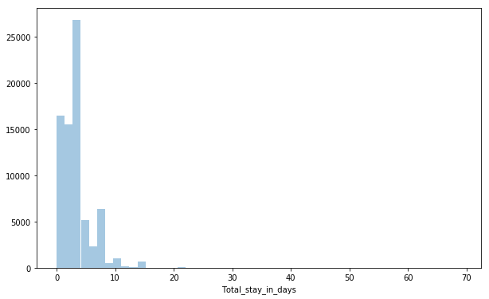

```python
import numpy as np
import pandas as pd
import matplotlib.pyplot as plt
import seaborn as sns
%matplotlib inline
```


```python
dataset = pd.read_csv('hotel_bookings.csv')
```


```python
dataset.shape
```


    (119390, 32)


```python
dataset.dtypes
```


    hotel                              object
    is_canceled                         int64
    lead_time                           int64
    arrival_date_year                   int64
    arrival_date_month                 object
    arrival_date_week_number            int64
    arrival_date_day_of_month           int64
    stays_in_weekend_nights             int64
    stays_in_week_nights                int64
    adults                              int64
    children                          float64
    babies                              int64
    meal                               object
    country                            object
    market_segment                     object
    distribution_channel               object
    is_repeated_guest                   int64
    previous_cancellations              int64
    previous_bookings_not_canceled      int64
    reserved_room_type                 object
    assigned_room_type                 object
    booking_changes                     int64
    deposit_type                       object
    agent                             float64
    company                           float64
    days_in_waiting_list                int64
    customer_type                      object
    adr                               float64
    required_car_parking_spaces         int64
    total_of_special_requests           int64
    reservation_status                 object
    reservation_status_date            object
    dtype: object


# Tasks

### 1. Doing Exploratory Data Analysis (EDA) on given dataset
 Exploratory data analysis will help business to get insight on data.
 We will also find important featured from dataset
 In EDA we will try to answer following questions
 - From which part of the world our most customer come?
 - Which month of the year is important for business 
 - How much people are ready to pay for one night?
 - What are important features in predicting cancelation?


### 2. Predicting cancelation
 We will try predict when customer will cancel booking based on the variables found in EDA

 

# Data Cleaning


```python
dataset.isna().sum() 
```


    hotel                                  0
    is_canceled                            0
    lead_time                              0
    arrival_date_year                      0
    arrival_date_month                     0
    arrival_date_week_number               0
    arrival_date_day_of_month              0
    stays_in_weekend_nights                0
    stays_in_week_nights                   0
    adults                                 0
    children                               4
    babies                                 0
    meal                                   0
    country                              488
    market_segment                         0
    distribution_channel                   0
    is_repeated_guest                      0
    previous_cancellations                 0
    previous_bookings_not_canceled         0
    reserved_room_type                     0
    assigned_room_type                     0
    booking_changes                        0
    deposit_type                           0
    agent                              16340
    company                           112593
    days_in_waiting_list                   0
    customer_type                          0
    adr                                    0
    required_car_parking_spaces            0
    total_of_special_requests              0
    reservation_status                     0
    reservation_status_date                0
    dtype: int64


```python
null_data_to_replace = {'children': 0,
                        'country' : 'Unknown',
                        'agent' : 0,
                        'company':0
                       }
dataset = dataset.fillna(null_data_to_replace)
dataset.isna().sum() 
```


    hotel                             0
    is_canceled                       0
    lead_time                         0
    arrival_date_year                 0
    arrival_date_month                0
    arrival_date_week_number          0
    arrival_date_day_of_month         0
    stays_in_weekend_nights           0
    stays_in_week_nights              0
    adults                            0
    children                          0
    babies                            0
    meal                              0
    country                           0
    market_segment                    0
    distribution_channel              0
    is_repeated_guest                 0
    previous_cancellations            0
    previous_bookings_not_canceled    0
    reserved_room_type                0
    assigned_room_type                0
    booking_changes                   0
    deposit_type                      0
    agent                             0
    company                           0
    days_in_waiting_list              0
    customer_type                     0
    adr                               0
    required_car_parking_spaces       0
    total_of_special_requests         0
    reservation_status                0
    reservation_status_date           0
    dtype: int64


# Exploratory Data Analysis (EDA)

## From which part of the world our most customer come?


```python
number_of_guests_by_country = dataset['country'].value_counts()
```


```python
percent_booking_by_country = dataset['country'].value_counts() / dataset.shape[0] * 100
```


```python
country_name = number_of_guests_by_country.index
```


```python
country_data = pd.DataFrame(percent_booking_by_country)
```


```python
country_data['Number of guests'] = number_of_guests_by_country
```


```python
country_data.head(10)
```


<div>
<style scoped>
    .dataframe tbody tr th:only-of-type {
        vertical-align: middle;
    }

    .dataframe tbody tr th {
        vertical-align: top;
    }

    .dataframe thead th {
        text-align: right;
    }
</style>
<table border="1" class="dataframe">
  <thead>
    <tr style="text-align: right;">
      <th></th>
      <th>country</th>
      <th>Number of guests</th>
    </tr>
  </thead>
  <tbody>
    <tr>
      <th>PRT</th>
      <td>40.698551</td>
      <td>48590</td>
    </tr>
    <tr>
      <th>GBR</th>
      <td>10.159142</td>
      <td>12129</td>
    </tr>
    <tr>
      <th>FRA</th>
      <td>8.723511</td>
      <td>10415</td>
    </tr>
    <tr>
      <th>ESP</th>
      <td>7.176480</td>
      <td>8568</td>
    </tr>
    <tr>
      <th>DEU</th>
      <td>6.103526</td>
      <td>7287</td>
    </tr>
    <tr>
      <th>ITA</th>
      <td>3.154368</td>
      <td>3766</td>
    </tr>
    <tr>
      <th>IRL</th>
      <td>2.826870</td>
      <td>3375</td>
    </tr>
    <tr>
      <th>BEL</th>
      <td>1.961638</td>
      <td>2342</td>
    </tr>
    <tr>
      <th>BRA</th>
      <td>1.862803</td>
      <td>2224</td>
    </tr>
    <tr>
      <th>NLD</th>
      <td>1.762292</td>
      <td>2104</td>
    </tr>
  </tbody>
</table>
</div>


```python
plt.figure(figsize=(10,10))
wedges, texts, autotexts = plt.pie(number_of_guests_by_country[percent_booking_by_country > 1], labels=country_name[percent_booking_by_country > 1], autopct='%1.1f%%')
plt.setp(autotexts, size=12)
plt.title("Top 10 countries by number of guests")
plt.show()
```


We can clearly see that most of out customer are from Portugal, Great Briton, France, Spain and other countries on Europe

## Which month of the year is important for business?


```python
dataset.head()
```


<div>
<style scoped>
    .dataframe tbody tr th:only-of-type {
        vertical-align: middle;
    }

    .dataframe tbody tr th {
        vertical-align: top;
    }

    .dataframe thead th {
        text-align: right;
    }
</style>
<table border="1" class="dataframe">
  <thead>
    <tr style="text-align: right;">
      <th></th>
      <th>hotel</th>
      <th>is_canceled</th>
      <th>lead_time</th>
      <th>arrival_date_year</th>
      <th>arrival_date_month</th>
      <th>arrival_date_week_number</th>
      <th>arrival_date_day_of_month</th>
      <th>stays_in_weekend_nights</th>
      <th>stays_in_week_nights</th>
      <th>adults</th>
      <th>...</th>
      <th>deposit_type</th>
      <th>agent</th>
      <th>company</th>
      <th>days_in_waiting_list</th>
      <th>customer_type</th>
      <th>adr</th>
      <th>required_car_parking_spaces</th>
      <th>total_of_special_requests</th>
      <th>reservation_status</th>
      <th>reservation_status_date</th>
    </tr>
  </thead>
  <tbody>
    <tr>
      <th>0</th>
      <td>Resort Hotel</td>
      <td>0</td>
      <td>342</td>
      <td>2015</td>
      <td>July</td>
      <td>27</td>
      <td>1</td>
      <td>0</td>
      <td>0</td>
      <td>2</td>
      <td>...</td>
      <td>No Deposit</td>
      <td>0.0</td>
      <td>0.0</td>
      <td>0</td>
      <td>Transient</td>
      <td>0.0</td>
      <td>0</td>
      <td>0</td>
      <td>Check-Out</td>
      <td>2015-07-01</td>
    </tr>
    <tr>
      <th>1</th>
      <td>Resort Hotel</td>
      <td>0</td>
      <td>737</td>
      <td>2015</td>
      <td>July</td>
      <td>27</td>
      <td>1</td>
      <td>0</td>
      <td>0</td>
      <td>2</td>
      <td>...</td>
      <td>No Deposit</td>
      <td>0.0</td>
      <td>0.0</td>
      <td>0</td>
      <td>Transient</td>
      <td>0.0</td>
      <td>0</td>
      <td>0</td>
      <td>Check-Out</td>
      <td>2015-07-01</td>
    </tr>
    <tr>
      <th>2</th>
      <td>Resort Hotel</td>
      <td>0</td>
      <td>7</td>
      <td>2015</td>
      <td>July</td>
      <td>27</td>
      <td>1</td>
      <td>0</td>
      <td>1</td>
      <td>1</td>
      <td>...</td>
      <td>No Deposit</td>
      <td>0.0</td>
      <td>0.0</td>
      <td>0</td>
      <td>Transient</td>
      <td>75.0</td>
      <td>0</td>
      <td>0</td>
      <td>Check-Out</td>
      <td>2015-07-02</td>
    </tr>
    <tr>
      <th>3</th>
      <td>Resort Hotel</td>
      <td>0</td>
      <td>13</td>
      <td>2015</td>
      <td>July</td>
      <td>27</td>
      <td>1</td>
      <td>0</td>
      <td>1</td>
      <td>1</td>
      <td>...</td>
      <td>No Deposit</td>
      <td>304.0</td>
      <td>0.0</td>
      <td>0</td>
      <td>Transient</td>
      <td>75.0</td>
      <td>0</td>
      <td>0</td>
      <td>Check-Out</td>
      <td>2015-07-02</td>
    </tr>
    <tr>
      <th>4</th>
      <td>Resort Hotel</td>
      <td>0</td>
      <td>14</td>
      <td>2015</td>
      <td>July</td>
      <td>27</td>
      <td>1</td>
      <td>0</td>
      <td>2</td>
      <td>2</td>
      <td>...</td>
      <td>No Deposit</td>
      <td>240.0</td>
      <td>0.0</td>
      <td>0</td>
      <td>Transient</td>
      <td>98.0</td>
      <td>0</td>
      <td>1</td>
      <td>Check-Out</td>
      <td>2015-07-03</td>
    </tr>
  </tbody>
</table>
<p>5 rows × 32 columns</p>
</div>


```python
plt.figure(figsize=(12,8))
ordered_month = ["January", "February", "March", "April", "May", "June", 
          "July", "August", "September", "October", "November", "December"]
sns.countplot(data = dataset, x= 'arrival_date_month', palette='viridis', order=ordered_month, hue='hotel')
plt.title('Number of Guests by Month', fontsize=24)
plt.xticks(rotation=45, fontsize=12)
plt.xlabel('Month', fontsize=16)

plt.ylabel('Number of Guests', fontsize=16)
```


    Text(0, 0.5, 'Number of Guests')


We can see that for resorts July and August are most important month, while for city hotels April through October are important months

## How long people stay at hotel?


```python
dataset['Total_stay_in_days'] = dataset['stays_in_weekend_nights'] +dataset['stays_in_week_nights']
```


```python
plt.figure(figsize=(10,6))
sns.distplot(dataset['Total_stay_in_days'][dataset['is_canceled'] == 0], kde=False )
```


    <matplotlib.axes._subplots.AxesSubplot at 0x2141e5ee048>





```python
plt.figure(figsize=(10,6))
sns.distplot(dataset['Total_stay_in_days'][dataset['is_canceled'] == 0][dataset['Total_stay_in_days'] < 20],kde=False, bins=15 )
plt.title('Stay in number of Days')
```


    Text(0.5, 1.0, 'Stay in number of Days')


We can clearly see that most people stayed in hotel for 0-5 days

Let's find out if there is any difference in stay duration of city hotel and resorts


```python
plt.figure(figsize=(10,6))
sns.distplot(dataset['Total_stay_in_days'][dataset['is_canceled'] == 0][dataset['Total_stay_in_days'] < 20][dataset['hotel']=='Resort Hotel'],kde=False, bins=15 )
plt.title('Stay in number of Days(Resort Hotel)')
```


    Text(0.5, 1.0, 'Stay in number of Days(Resort Hotel)')


```python
plt.figure(figsize=(10,6))
sns.distplot(dataset['Total_stay_in_days'][dataset['is_canceled'] == 0][dataset['Total_stay_in_days'] < 20][dataset['hotel']=='City Hotel'],kde=False, bins=15 )
plt.title('Stay in number of Days(City Hotel)')
```


    Text(0.5, 1.0, 'Stay in number of Days(City Hotel)')


```python
dataset[['hotel','Total_stay_in_days']][dataset['is_canceled'] == 0].groupby(by='hotel').mean()
```


<div>
<style scoped>
    .dataframe tbody tr th:only-of-type {
        vertical-align: middle;
    }

    .dataframe tbody tr th {
        vertical-align: top;
    }

    .dataframe thead th {
        text-align: right;
    }
</style>
<table border="1" class="dataframe">
  <thead>
    <tr style="text-align: right;">
      <th></th>
      <th>Total_stay_in_days</th>
    </tr>
    <tr>
      <th>hotel</th>
      <th></th>
    </tr>
  </thead>
  <tbody>
    <tr>
      <th>City Hotel</th>
      <td>2.923618</td>
    </tr>
    <tr>
      <th>Resort Hotel</th>
      <td>4.142892</td>
    </tr>
  </tbody>
</table>
</div>


#### Conclusion: People stay in resorts longer than city hotel for longer duration (for obvious reason)

## Is there any relation between lead time and cancelation?


```python
lead_time_data = dataset[['lead_time', 'is_canceled']].groupby(by='lead_time').count()
lead_time_data.rename({'is_canceled': 'number_of_bookings'}, inplace=True, axis=1)
lead_time_data['canceled_bookings'] = dataset[['lead_time', 'is_canceled']].groupby(by='lead_time').sum()
lead_time_data['percent_cancelation'] = lead_time_data['canceled_bookings']/lead_time_data['number_of_bookings']
```


```python
lead_time_data['percent_cancelation'] = lead_time_data['canceled_bookings']/lead_time_data['number_of_bookings']
lead_time_data = lead_time_data.reset_index()
```


```python
lead_time_data.tail(10)
```


<div>
<style scoped>
    .dataframe tbody tr th:only-of-type {
        vertical-align: middle;
    }

    .dataframe tbody tr th {
        vertical-align: top;
    }

    .dataframe thead th {
        text-align: right;
    }
</style>
<table border="1" class="dataframe">
  <thead>
    <tr style="text-align: right;">
      <th></th>
      <th>lead_time</th>
      <th>number_of_bookings</th>
      <th>canceled_bookings</th>
      <th>percent_cancelation</th>
    </tr>
  </thead>
  <tbody>
    <tr>
      <th>469</th>
      <td>594</td>
      <td>17</td>
      <td>17</td>
      <td>1.0</td>
    </tr>
    <tr>
      <th>470</th>
      <td>601</td>
      <td>17</td>
      <td>17</td>
      <td>1.0</td>
    </tr>
    <tr>
      <th>471</th>
      <td>605</td>
      <td>30</td>
      <td>30</td>
      <td>1.0</td>
    </tr>
    <tr>
      <th>472</th>
      <td>608</td>
      <td>17</td>
      <td>17</td>
      <td>1.0</td>
    </tr>
    <tr>
      <th>473</th>
      <td>615</td>
      <td>17</td>
      <td>17</td>
      <td>1.0</td>
    </tr>
    <tr>
      <th>474</th>
      <td>622</td>
      <td>17</td>
      <td>17</td>
      <td>1.0</td>
    </tr>
    <tr>
      <th>475</th>
      <td>626</td>
      <td>30</td>
      <td>30</td>
      <td>1.0</td>
    </tr>
    <tr>
      <th>476</th>
      <td>629</td>
      <td>17</td>
      <td>17</td>
      <td>1.0</td>
    </tr>
    <tr>
      <th>477</th>
      <td>709</td>
      <td>1</td>
      <td>0</td>
      <td>0.0</td>
    </tr>
    <tr>
      <th>478</th>
      <td>737</td>
      <td>1</td>
      <td>0</td>
      <td>0.0</td>
    </tr>
  </tbody>
</table>
</div>


```python
plt.figure(figsize=(14,6))
sns.lineplot(data=lead_time_data, x= 'lead_time', y='percent_cancelation')
```


    <matplotlib.axes._subplots.AxesSubplot at 0x21422244a90>


We can conclude that as lead time increase, cancelation percent also increases


```python

```
