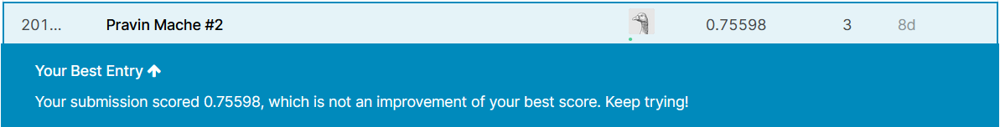
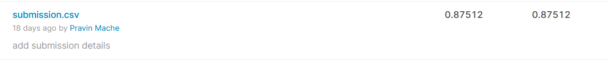
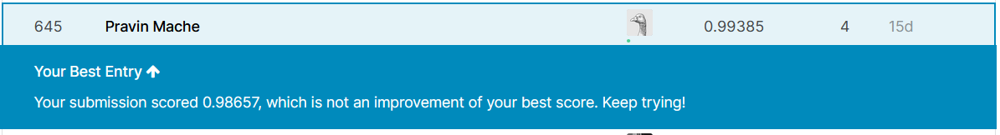

# Machine Learning with Python

## Exploratory Data Analysis

* Hotel Booking Demand on kaggle dataset
https://www.kaggle.com/jessemostipak/hotel-booking-demand

## Classification
1. Titanic survival Prediction

## Clustering
* Kmeans clustering
* DBScan
* Agglomerative Clustering

## Recommnder System
* Content Based Recommender System

## Data visualization

* Waffle Chart

## Natual Language Processing
1. IMDB movie review - Sentiment Analysis with Bag of word model

## Deep Learning

1. Digit Recognizer Kaggle compitition on MNIST dataset
	* CNN, Keras, Tensorflow
	

